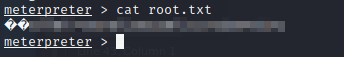

# Alfred Writeup

## Overview

This is my writeup for the Alfred room on TryHackMe.  This Batman themed room requires you to exploit Jenkins by gaining access through powershell, then escalating your privileges by exploiting Windows authentication tokens.  This is an easy room, so if you are new to Windows exploitation, then this is ideal for you.  Furthermore, if you have completed the Steel Mountain CTF (writeup [here](/Steel%20Mountain/README.md)), then you will be familiar with the techniques used here.

## How to Access

I completed this room on TryHackMe.  The link to the room is shown below:

- https://tryhackme.com/room/alfred

## Steps

As usual, I begin with an nmap scan:

```
$ nmap -sC -sV -oN initial 10.10.143.88 -Pn
# Nmap 7.91 scan initiated Sat May 22 20:20:01 2021 as: nmap -sC -sV -oN initial -Pn 10.10.143.88
Nmap scan report for 10.10.143.88
Host is up (0.038s latency).
Not shown: 997 filtered ports
PORT     STATE SERVICE    VERSION
80/tcp   open  http       Microsoft IIS httpd 7.5
| http-methods: 
|_  Potentially risky methods: TRACE
|_http-title: Site doesn't have a title (text/html).
3389/tcp open  tcpwrapped
8080/tcp open  http       Jetty 9.4.z-SNAPSHOT
| http-robots.txt: 1 disallowed entry 
|_/
|_http-title: Site doesn't have a title (text/html;charset=utf-8).
Service Info: OS: Windows; CPE: cpe:/o:microsoft:windows

Service detection performed. Please report any incorrect results at https://nmap.org/submit/ .
# Nmap done at Sat May 22 20:22:28 2021 -- 1 IP address (1 host up) scanned in 147.04 seconds
```

As you can see, there are two web servers running - one on port 80 and another on port 8080.  The first site is a memorial page for Bruce Wayne with an email: *alfred@wayneenterprises.com*:


The second site is a Jenkins login form:


After trying some default credentials, I was able to login using the **admin:admin** combination.  Looking further into the site, I found a way to execute bash commands on the windows machine (under `/job/project/configure` in the "Build" section).

Firstly, I created a Python HTTP server so that I can upload the powershell script.  I also created a netcat listener to catch the callback.


I found the `user.txt` flag in the `C:\Users\bruce\Desktop` directory:


I then escalated my shell to a meterpreter shell by creating a payload with msfvenom:


I then used the following command, along with a metasploit listener to catch the result:


Setting up `multi/handler`:


After I executed the exploit, it spawned a meterpreter shell as `alfred\bruce`:


Then, I looked into the privileges of the user using `whoami /priv`:


As shown above, `SeDebugPrivilege` and `SeImpersonatePrivilege` are enabled.  After loading the incognito module, I listed the available tokens:
 


The `BUILTIN\Administrator` token is available, so I can use this to impersonate the admin:


However, even though I have higher privileges, I don't have the permissions of the admin user.  This is due to how Windows handles permissions - it uses the Primary Token of the process instead of the token to identify what the process can/cannot do.

To fix this, I migrated to the process with the correct permissions:


Finally, I found the `root.txt` flag in the `C:\Windows\System\config` directory:



And that's it!  All done!
