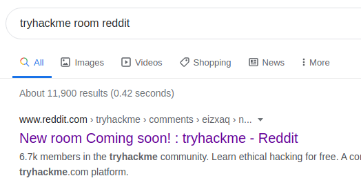
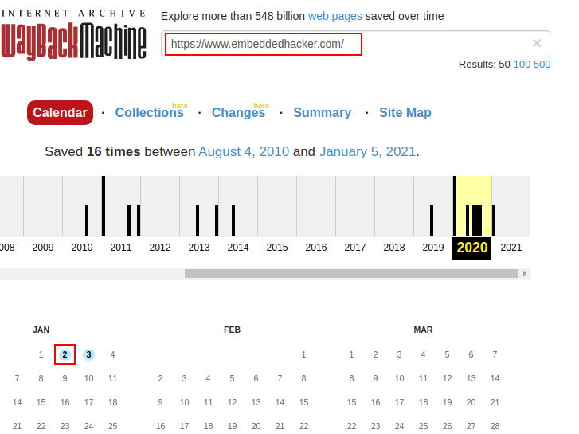
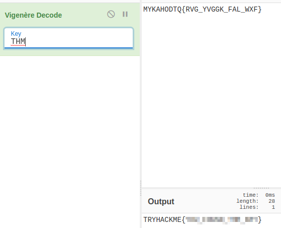

# CTF Collection Vol. 1 - Writeup

## Overview

This is my writeup for the "CTF Collection Vol. 1" CTF.  This room is designed to introduce you to how cryptography, stegonography, and binary CTF challenges are set, so if you are a beginner, this is perfect for you!

### How to Access

I completed this through the TryHackMe website.  

Link to the room:
- https://tryhackme.com/room/ctfcollectionvol1

## Steps

### Task 1 - What does the base said?

*Can you decode the following?*

*VEhNe2p1NTdfZDNjMGQzXzdoM19iNDUzfQ==*

This is base64, decode it using the terminal:

```
$ echo "VEhNe2p1NTdfZDNjMGQzXzdoM19iNDUzfQ==" | base64 --decode
THM{j******************3}
```

### Task 2 - Meta meta

*Meta! meta! meta! meta...................................*

**SEE Findme.jpg**

To decode information from images, use `exiftool`:

```
$ exiftool Findme.jpg                                              
ExifTool Version Number         : 12.16
File Name                       : Findme.jpg
Directory                       : .
File Size                       : 34 KiB
File Modification Date/Time     : 2021:03:01 22:29:34+00:00
File Access Date/Time           : 2021:03:01 22:29:37+00:00
File Inode Change Date/Time     : 2021:03:01 22:32:21+00:00
File Permissions                : rw-r--r--
File Type                       : JPEG
File Type Extension             : jpg
MIME Type                       : image/jpeg
JFIF Version                    : 1.01
X Resolution                    : 96
Y Resolution                    : 96
Exif Byte Order                 : Big-endian (Motorola, MM)
Resolution Unit                 : inches
Y Cb Cr Positioning             : Centered
Exif Version                    : 0231
Components Configuration        : Y, Cb, Cr, -
Flashpix Version                : 0100
Owner Name                      : THM{3x1f_0r_3x17}
Comment                         : CREATOR: gd-jpeg v1.0 (using IJG JPEG v62), quality = 60.
Image Width                     : 800
Image Height                    : 480
Encoding Process                : Progressive DCT, Huffman coding
Bits Per Sample                 : 8
Color Components                : 3
Y Cb Cr Sub Sampling            : YCbCr4:2:0 (2 2)
Image Size                      : 800x480
Megapixels                      : 0.384
```

As you can see from the "Owner Name", the flag is: `THM{3**********7}`.

### Task 3 - Mon, are we going to be okay?

*Something is hiding.  That's all you need to know*

**SEE Extinction.jpg**

Had to use `steghide` for this:

```
$ steghide info Extinction.jpg
"Extinction.jpg":
  format: jpeg
  capacity: 1.3 KB
Try to get information about embedded data ? (y/n) y
Enter passphrase:
  embedded file "Final_message.txt":
    size: 79.0 Byte
    encrypted: rijndael-128, cbc
    compressed: yes
```

Looks like there is a file embedded in the image.  Let's extract it:

```
$ steghide extract -sf Extinction.jpg
Enter passphrase:
wrote extracted data to "Final_message.txt".
```

Final_message.txt

```
It going to be over soon. Sleep my child.

THM{5****************************n}
```

### Task 4 - Erm......Magick

*Huh, where is the flag*

The flag was embedded in the text shown above.  Highlighting it gave:

`Huh, where is the flag? THM{w********6}`

### Task 5 - QRrrrr

*Such technology is quite reliable.*

**SEE QR.png**

Scanning the QR code reveals the flag:

`THM{q***************y}`

### Task 6 - Reverse or read it?

*Both works, it's all up to you.*

**SEE hello.hello**

Using `r2` we can look deeply into the file:

```
$ r2 hello.hello
Warning: run r2 with -e io.cache=true to fix relocations in disassembly
[0x00001060]> aaa
[x] Analyze all flags starting with sym. and entry0 (aa)
[x] Analyze function calls (aac)
[x] Analyze len bytes of instructions for references (aar)
[x] Check for vtables
[x] Type matching analysis for all functions (aaft)
[x] Propagate noreturn information
[x] Use -AA or aaaa to perform additional experimental analysis.
[0x00001060]> afl
0x00001060    1 42           entry0
0x00001090    4 41   -> 34   sym.deregister_tm_clones
0x000010c0    4 57   -> 51   sym.register_tm_clones
0x00001100    5 57   -> 50   sym.__do_global_dtors_aux
0x00001050    1 6            sym.imp.__cxa_finalize
0x00001140    1 5            entry.init0
0x00001000    3 23           sym._init
0x000011e0    1 1            sym.__libc_csu_fini
0x00001145    1 24           sym.skip
0x00001040    1 6            sym.imp.printf
0x000011e4    1 9            sym._fini
0x00001180    4 93           sym.__libc_csu_init
0x0000115d    1 23           main
0x00001030    1 6            sym.imp.puts
[0x00001060]> pdf @sym.skip
┌ 24: sym.skip ();
│           0x00001145      55             push rbp
│           0x00001146      4889e5         mov rbp, rsp
│           0x00001149      488d3db80e00.  lea rdi, str.THM345y_f1nd_345y_60 ; 0x2008 ; "THM{345y_f1nd_345y_60}" ; const char *format
│           0x00001150      b800000000     mov eax, 0
│           0x00001155      e8e6feffff     call sym.imp.printf         ; int printf(const char *format)
│           0x0000115a      90             nop
│           0x0000115b      5d             pop rbp
└           0x0000115c      c3             ret
```

As we can see, the flag `THM{3***************0}`.

### Task 7 - Another decoding stuff

*Can you decode it?*

*3agrSy1CewF9v8ukcSkPSYm3oKUoByUpKG4L*

This is base58.  I used CyberChef to decode it:

`THM{1*******************5}`

### Task 8 - Left or right

*Left, right, left, right... Rot 13 is too mainstream for this.*

*MAF{atbe_max_vtxltk}*

This is a Caeser cipher with a shift value of 7.

`THM{h*************r}`

### Task 9 - Make a comment

*No downloadable file, no ciphered or encoded text.  Huh .....*

The flag for this was embedded in the HTML code as a comment:

``<p style="display:none;"> THM{4**********************7} </p>``

### Task 10 - Can you fix it?

*I accidentally messed up with this PNG file.  Can you help me fix it?  Thanks ^^*

**SEE spoil.png**

As the challenge states, this is a corrupted PNG file.  I first dumped the contents into a file using `xxd`:

`$ xxd --plain spoil.png > spoil_hex_dump.txt`

Looking at the head of the file shows:

```
$ head spoil_hex_dump              
2333445f0d0a1a0a0000000d4948445200000320000003200806000000db
700668000000017352474200aece1ce9000000097048597300000ec40000
0ec401952b0e1b0000200049444154789cecdd799c9c559deff1cf799e5a
bb7a5f927477f640480209201150c420bba288a8805c19067c5d64c079e9
752e03ce38e30e8e2f75e63a23ea8c0ce8308e036470c191cd80880c4b20
0909184c42b64ed2e9f4bed7f23ce7fe51559dea4e27a4bbaaf7effbf5ea
57d2d5554f9daa7abafa7ceb9cf33bc65a6b1111111111111907ce443740
4444444444660e0510111111111119370a202222222222326e1440444444
444464dc28808888888888c8b8510011111111119171a300222222222222
e34601444444444444c68d028888888888888c1b0510111111111119370a
```

The front 8 characters indicate the format of the given file.  For PNG, it is 89504e47, and as shown above, the first 8 characters are 2333445f.  I changed this using `nano`.

To get the flag I had to upload the image to CyberChef.  I first had to decode the information from the hex format, and then render the iamge using the raw data.


### Task 11 - Read it

*Some hidden flag inside Tryhackme social account.*

The hint for this challenge is simply "**reddit**".  A quick Google search for "TryHackMe room reddit" gives the following result:



Navigating to this page gives the flag:


### Task 12 - Spin my head

*What is this?*

```
++++++++++[>+>+++>+++++++>++++++++++<<<<-]>>>++++++++++++++.------------.+++++.>+++++++++++++++++++++++.<<++++++++++++++++++.>>-------------------.---------.++++++++++++++.++++++++++++.<++++++++++++++++++.+++++++++.<+++.+.>----.>++++.
```

The hint for this challenge is **binaryfuck**.  

The given code uses the programming language "brainfuck".  I used an online decoder to get the flag.


### Task 13 - An exclusive

*Exclusive strings for everyone!*

```
S1: 44585d6b2368737c65252166234f20626d
S2: 1010101010101010101010101010101010
```

Going by the challenge name, I assumed this would be XOR.  Using an online XOR calculator gave me the flag:


### Task 14 - Binary walk

*Please exflitrate my file :)*

**SEE hell.jpg**

The hint for this challenge is **Binwalk**.  After some research, I found that this was a tool for searching a binary image for embedded files and executable code.  Using this in the terminal gave me an extracted file called "hello_there.txt" which contained the flag:

```
$ binwalk hell.jpg   

DECIMAL       HEXADECIMAL     DESCRIPTION
--------------------------------------------------------------------------------
0             0x0             JPEG image data, JFIF standard 1.02
30            0x1E            TIFF image data, big-endian, offset of first image directory: 8
265845        0x40E75         Zip archive data, at least v2.0 to extract, uncompressed size: 69, name: hello_there.txt
266099        0x40F73         End of Zip archive, footer length: 22

$ cat _hell.jpg.extracted/hello_there.txt
Thank you for extracting me, you are the best!

THM{y0***********u7}
```

### Task 15 - Darkness

*There is something lurking in the dark.*

**SEE dark.png**

The challenge hint suggested using stegsolve.  Running this with the opened file, I began to cycle through the planes.  Eventually I found the flag (Blue plane phase 1):


### Task 16 - A sounding QR

*How good is your listening skill?*

**SEE QRCRF.png**

Decoding the QR code revealed a link to a soundcloud track:


The music track gives the flag (you might have to slow it down).

### Task 17 - Dig up the past

*Sometimes we need a 'machine' to dig the past*

*Target website: https://www.embeddedhacker.com/*
*Targetted time: 2 January 2020*

The hint for this challenge is the **Wayback machine**.  This is a website that stores web pages with the date and time of each captured site.

Searching for the target website on the WayBack machine and using the target time:



This revealed the layout of the website, giving me the flag:


### Task 18 - Uncrackable!

*Can you solve the following?  By the way, I lost the key.  Sorry >.<*

*MYKAHODTQ{RVG_YVGGK_FAL_WXF}*
*Flag format: TRYHACKME{FLAG IN ALL CAP}*

From the clue word "key" I assumed this would be some key-based cipher.  I tried a few different ones with various keys and eventually found the flag using the Vigenere cipher with the key "THM":



### Task 19 - Small bases

*Decode the following text.*

*581695969015253365094191591547859387620042736036246486373595515576333693*

Using the hint (**dec -> hex -> ascii**), I first converted the string to hex and then from hex into textual format:


### Task 20 - Read the packet

*I just hacked my neighbor's WiFi and try to capture some packet.  He must be up to no good.  Help me find it.*

**SEE flag.pcapng**

Using wireshark, I used the filter to find HTTP GET requests:


I then followed the HTTP stream and found the flag:


### Summary and Feedback

While these challenges were very straightfoward, they were also a lot of fun.  This room provides a very good basis for those who are intereseted in cryptography and wish to learn how to attempt more complex challengs.
