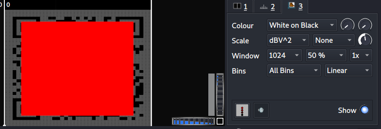

# Cicada 3301 Vol. 1 - Writeup

## Overview

This is my writeup for the Cicada 3301 Vol. 1 CTF.  This challenge is based on the same real-life internet puzzle by the same name.  This challenge uses a mix of intermediate steganography and cryptography techniques as well as using the same methods from the real-life challenge.

## History of the Challenge

The real-life challenge was originally set on January 4th 2012, on 4chan and ran for around a month.  A second challenge began a year later with the third and final round the consecutive year.  Cicada 3301 is the name given to the organisation who issued the challenges.

The purpose of the puzzles were to find and recruit "highy intelligent individuals" who wish to improve cryptography, privacy and anonymity online.  The third challenge still remains unsolved and Cicada 3301 has remained silence since it was issued.

## How to Access

I completed this challenge on TryHackMe:

Link to the room:
- https://tryhackme.com/room/cicada3301vol1

## Steps

Two files are given as part of the challenge:
- 3301.wav
- welcome.jpg

### Analyze The Audio

*Use Sonic Visualizer to analyze the audio*

Opening Sonic Visualizer and importing the `3301.wav` audio file shows the waveform:


Listening to the file will not reveal anything special.  To find the solution, add a spectogram:


For some reason I could not scan the QR code in the format above, so I added a white-on-black filter:



Scanning the QR code gives the link, which is the answer to the first challenge:

``https://pastebin.com/w******a``

### Decode the Passprahse

The link from the previous challenge reveals the following text:

```
Passphrase: S*********************h
Key: Q******h
```

Both of which are encoded using Base64:

```
Passphrase: H***_*_*********3!
Key: C****a
```

The next task specifies that you need to use the passphrase along with the key to fully decode the cipher.  The hint for the challenge is *French Diplomat Cipher*.  A quick Google search reveals that the French diplomat is Blaise de Vigenère who was also a cryptographer and the supposed creator of the Vigenère cipher.  

Using the key and the passphrase with the cipher gives the fully decoded passphrase:


### Gather Metadata

This task involves using `steghide` against the `welcome.jpg` image to extract a link.

```
$ steghide extract -sf welcome.jpg
Enter passphrase:
the file "invitation.txt" does already exist. overwrite ? (y/n) y
wrote extracted data to "invitation.txt".
```

Using the passphrase reveals `invitation.txt` which contains the link: `https://imgur.com/a/c*****a`.

Make sure to download this image as it is needed for the next challenge.

### Find Hidden Files

The next challenge uses `outguess`, a steganography tool which was used to solve one of the original Cicada challenges.

``$ outguess -r imgur_image.jpg output``

The output is:

```
-----BEGIN PGP SIGNED MESSAGE-----
Hash: SHA1

Welcome again.

Here is a book code.  To find the book, break this hash:

b******************************************************************************************************************************8

Use positive integers to go forward in the text use negative integers to go backwards in the text.

I:1:6
I:2:15
I:3:26
I:5:4
I:6:15
I:10:26
/
/
I:13:5
I:13:1
I:14:7
I:3:29
I:19:8
I:22:25
/
I:23:-1
I:19:-1
I:2:21
I:5:9
I:24:-2
I:22:1
I:38:1


Good luck.

3301

-----BEGIN PGP SIGNATURE-----
Version: GnuPG v1.4.11 (GNU/Linux)

iQIcBAEBAgAGBQJQ5QoZAAoJEBgfAeV6NQkPf2IQAKWgwI5EC33Hzje+YfeaLf6m
sLKjpc2Go98BWGReikDLS4PpkjX962L4Q3TZyzGenjJSUAEcyoHVINbqvK1sMvE5
9lBPmsdBMDPreA8oAZ3cbwtI3QuOFi3tY2qI5sJ7GSfUgiuI6FVVYTU/iXhXbHtL
boY4Sql5y7GaZ65cmH0eA6/418d9KL3Qq3qkTcM/tRAHhOZFMZfT42nsbcvZ2sWi
YyrAT5C+gs53YhODxEY0T9M2fam5AgUIWrMQa3oTRHSoNAefrDuOE7YtPy40j7kk
5/5RztmAzeEdRd8QS1ktHMezXEhdDP/DEdIJCLT5eA27VnTY4+x1Ag9tsDFuitY4
2kEaVtCrf/36JAAwEcwOg2B/stdjXe10RHFStY0N9wQdReW3yAOBohvtOubicbYY
mSCS1Bx91z7uYOo2QwtRaxNs69beSSy+oWBef4uTir8Q6WmgJpmzgmeG7ttEHquj
69CLSOWOm6Yc6qixsZy7ZkYDrSVrPwpAZdEXip7OHST5QE/Rd1M8RWCOODba16Lu
URKvgl0/nZumrPQYbB1roxAaCMtlMoIOvwcyldO0iOQ/2iD4Y0L4sTL7ojq2UYwX
bCotrhYv1srzBIOh+8vuBhV9ROnf/gab4tJII063EmztkBJ+HLfst0qZFAPHQG22
41kaNgYIYeikTrweFqSK
=Ybd6
-----END PGP SIGNATURE-----
```

### Book Cipher

At first glance, it looks like the hash is SHA1 but this is incorrect.  The hash is actually SHA512.  Using `http://md5hashing.net` to crack it:

``https://pastebin.com/6******5``

This contains text from a book called *Liber AL vel Legis* by Aleister Crowley, which means *The Book of the Law*.  This was also used as part of the Cicada 3301 challenge.

To crack the code, use the instructions from the output earlier.  For instance, `I:1:6` means line 1, character 6.  It was also assumed that spaces are not counted although punctuation are.

Deciphering the message gives a link:

``https://bit.ly/3*****H``

### The Final Song

The link from the previous section redirects to a soundcloud music track, the name of which is the solution to the final challenge.


This song was published and produced by Cicada 3301 for the real-life challenge.

## Summary and Feedback

This was an extremely fun challenge.  If you are interested in steganopgrahy, cryptography, or the Cicada 3301 challenge, this is perfect for you!
