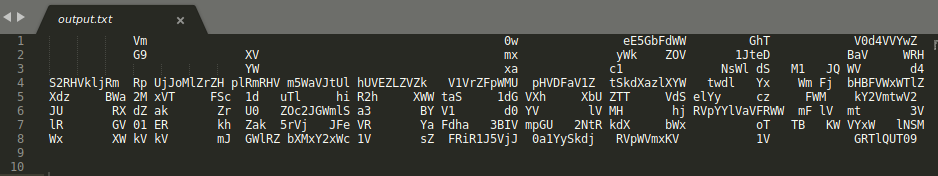
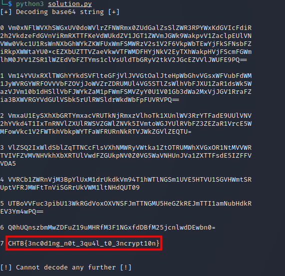

# NintendoBase64 Writeup

## Prompt

Aliens are trying to cause great misery for the human race by using our own cryptographic technology to encrypt all our games.
Fortunately, the aliens haven't played CryptoHack so they're making several noob mistakes. Therefore they've given us a chance to recover our games and find their flags.

They've tried to scramble data on an N64 but don't seem to understand that encoding and ASCII art are not valid types of encryption!

This challenge will raise 33 euros for a good cause.

## Steps

Opening the file shows a base64 string in the shape of "nintendo64".



I copied this string into https://base64decode.org and it returned another base64 encoded string.  I used Python to speed this process up and found the flag after 8 iterations:

```
#!/usr/bin/env python3

import base64
import sys

with open('output.txt', 'r') as f:
	cipher = f.read()

	cipher = ''.join(cipher).strip('\n').replace(' ', '')

	print("[+] Decoding base64 string [+]\n")

	for i in range(64):
		try: 
			cipher = base64.b64decode(cipher)
			print(i, cipher.decode('ascii'))
		except:
			print("\n[!] Cannot decode any further [!]")
			sys.exit()

```

