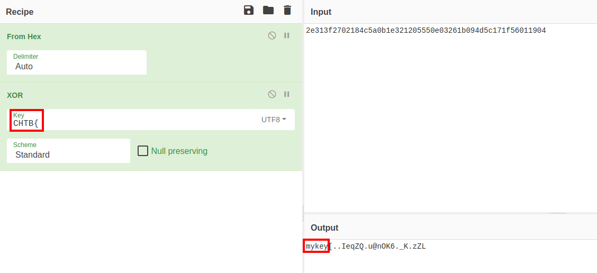
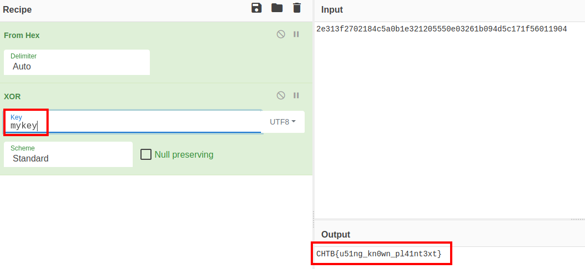

# Phasestream 1 Writeup

## Prompt

The aliens are trying to build a secure cipher to encrypt all our games called "PhaseStream". They've heard that stream ciphers are pretty good. The aliens have learned of the XOR operation which is used to encrypt a plaintext with a key. They believe that XOR using a repeated 5-byte key is enough to build a strong stream cipher. Such silly aliens! Here's a flag they encrypted this way earlier. 

Can you decrypt it (hint: what's the flag format?) 2e313f2702184c5a0b1e321205550e03261b094d5c171f56011904

This challenge will raise 33 euros for a good cause.

## Steps

I used [CyberChef](https://gchq.github.io/CyberChef/) to solve this.  I first decoded it from hex, then attempted to use XOR to retrieve the flag.  I used the known flag format as the key:

Substituting the "CTB{" text with "mykey" gives the flag:

