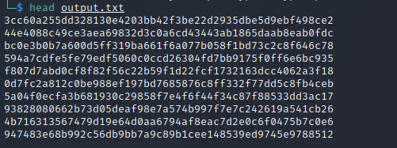
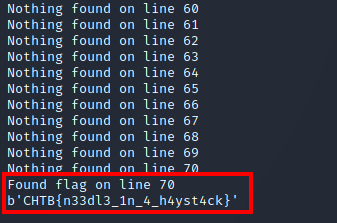

# Phasestream 2 Writeup

## Prompt

The aliens have learned of a new concept called "security by obscurity". Fortunately for us they think it is a great idea and not a description of a common mistake. We've intercepted some alien comms and think they are XORing flags with a single-byte key and hiding the result inside 9999 lines of random data, Can you find the flag?

This challenge will raise 33 euros for a good cause.

## Steps

The extracted file contains almost 10,000 lines of encoded hex strings, each 52 characters in length.  As the prompt mentions, each line is encoded with a single-byte key:



I then created a Python script to go through each line and decode it using XOR:

```
#!/usr/bin/env python

import sys
from pwn import *

lines = read('output.txt').splitlines()

print("[+] XOR-ing file [+]")

for i in range(0xff)
	print(f"Nothing found on line {i+1}")
	
	byte = bytes([i])

	for line in lines:
		xored = xor(unhex(line), byte)
		if b"CHTB" in xored:
			print(f"Found flag on line {i+1}")
			print(xored)
			sys.exit()
```

