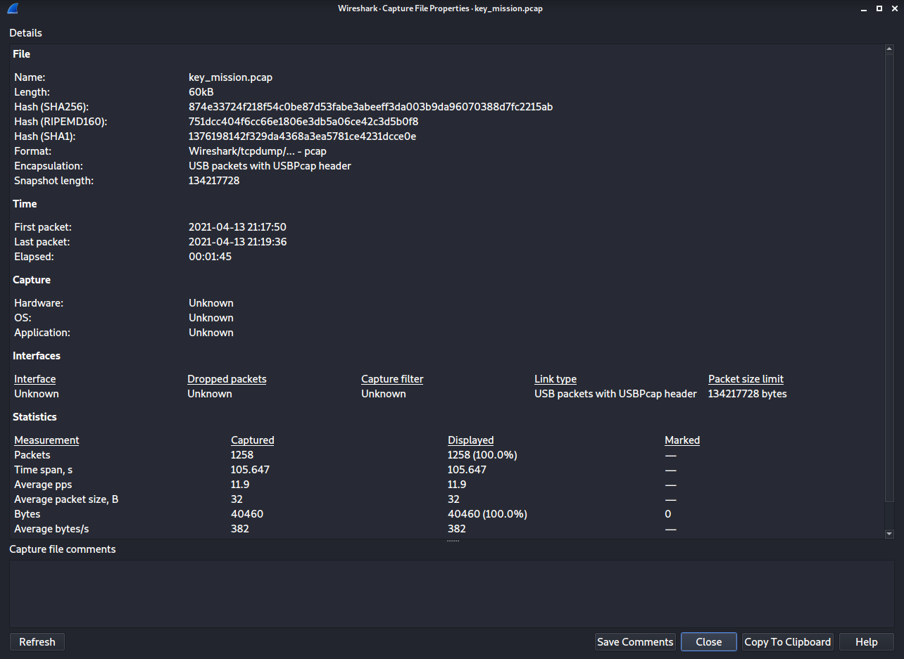

# Key Mission Writeup

## Prompt

The secretary of earth defense has been kidnapped. We have sent our elite team on the enemy's base to find his location. Our team only managed to intercept this traffic. Your mission is to retrieve secretary's hidden location.

This challenge will raise 33 euros for a good cause.

## Steps

After extracting the .pcap file, I opened it up in Wireshark.  It's clear from the capture file properties (Statistics->Capture File Properties) that we are dealing with USB data.



After inspecting the first few packets, I discovered that this capture is of a keyboard.  I used `tshark` to retrieve the HID data and mapped the output to a file:

```
$ tshark -r key_mission.pcap -T fields -e usbhid.data -Y 'usbhid.data' | grep -v 0000000000000000 > key_presses.txt
```

Using the script from the blog I found [here](https://blog.stayontarget.org/2019/03/decoding-mixed-case-usb-keystrokes-from.html), I decoded the data to get:


Reformatting the text gives the flag:

