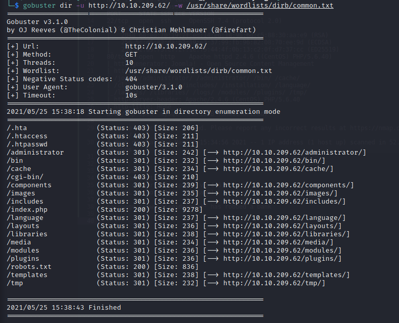
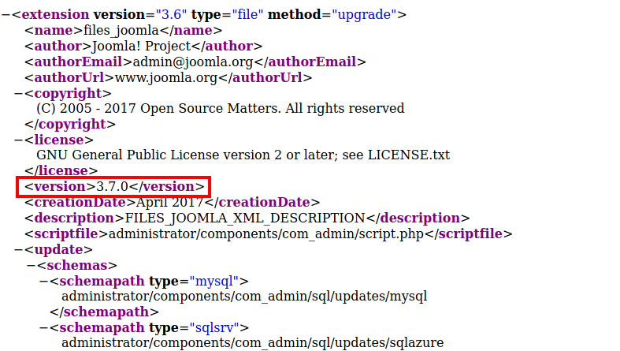

# Daily Bugle Writeup

## Overview

This is my writeup for the Daily Bugle room on TryHackMe.  This is a room based in the Spiderman universe where you have to comprimise a Joomla CMS system via SQL injection.  Then, after cracking some hashes, you escalate your privileges by taking advantage of `yum`.

This is a hard room, so if you're a beginner I would recommend attempting other rooms.

## How to Access

I completed this room on TryHackMe.  You can access it [here](https://tryhackme.org/room/dailybugle).

## Steps

#### Information Gathering and Enumeration

As always, let's begin with an `nmap` scan:

```
$ nmap -sC -sV -oN scans/initial 10.10.209.62
# Nmap 7.91 scan initiated Tue May 25 15:34:03 2021 as: nmap -sC -sV -oN scans/initial 10.10.209.62
Nmap scan report for 10.10.209.62
Host is up (0.055s latency).
Not shown: 997 closed ports
PORT     STATE SERVICE VERSION
22/tcp   open  ssh     OpenSSH 7.4 (protocol 2.0)
| ssh-hostkey: 
|   2048 68:ed:7b:19:7f:ed:14:e6:18:98:6d:c5:88:30:aa:e9 (RSA)
|   256 5c:d6:82:da:b2:19:e3:37:99:fb:96:82:08:70:ee:9d (ECDSA)
|_  256 d2:a9:75:cf:2f:1e:f5:44:4f:0b:13:c2:0f:d7:37:cc (ED25519)
80/tcp   open  http    Apache httpd 2.4.6 ((CentOS) PHP/5.6.40)
|_http-generator: Joomla! - Open Source Content Management
| http-robots.txt: 15 disallowed entries 
| /joomla/administrator/ /administrator/ /bin/ /cache/ 
| /cli/ /components/ /includes/ /installation/ /language/ 
|_/layouts/ /libraries/ /logs/ /modules/ /plugins/ /tmp/
|_http-server-header: Apache/2.4.6 (CentOS) PHP/5.6.40
|_http-title: Home
3306/tcp open  mysql   MariaDB (unauthorized)

Service detection performed. Please report any incorrect results at https://nmap.org/submit/ .
# Nmap done at Tue May 25 15:34:56 2021 -- 1 IP address (1 host up) scanned in 52.81 seconds
```

So, we have **three** ports open:
- SSH on port 22 (v7.4)
- HTTP on port 80 (Apache v2.4.6)
- MySQL on port 3306 (MariaDB)

The main page of the website shows an article where **spiderman** is caught robbing a bank:


Let's see if there is any directories which we can exploit (I use `gobuster` for this):



So this `gobuster` scan has revealed an `/administrator` directory which leads to a Joomla CMS login:


I did some research and found that the version of Joomla can be found at `http://<ip>/administrator/manifests/files/joomla.xml`.  The version of Joomla being used here is **3.7.0**:



#### Compromising Joomla via SQL Injection

A quick look on searchsploit shows that this version of Joomla is vulnerable to SQL injection.  I did some more research and found this Python script on GitHub: https://github.com/NinjaJc01/joomblah-3/blob/master/joomblah.py.  Downloading and executing this will reveal the hash for the `jonah` user:


#### Cracking Hashes with Hashcat

First, we need to determine the type of hash we are going to crack.  The [hashcat cheatsheet](https://hashcat.net/wiki/doku.php?id=example_hashes) shows that it is a "bcrypt $2\*$, Blowfish (Unix)" hash:


I used the following `hashcat` command to crack the hash.  This took me about 10 minutes to crack, so be patient (it may take you longer depending on your machine).

```
$ hashcat -a 0 -m 3200 hash /usr/share/wordlists/rockyou.txt
```

- `-a` specifies the attack mode
- `-m` specifies the hash type (3200 => "bcrypt $2\*$, Blowfish (Unix)")
- `hash` is the hash from our SQL injection
- `/usr/share/wordlists/rockyou.txt` is the wordlist

We can now login to Joomla as `jonah`:


#### Getting a Reverse Shell

In Joomla, you can edit the template files to get a reverse shell.  The article [here](https://www.hackingarticles.in/joomla-reverse-shell/) discusses this in very good detail.  I used the PHP reverse shell from pentest monkey (get it [here](https://github.com/pentestmonkey/php-reverse-shell))


Make sure to change the IP address and port, and then setup your `netcat` listener to accept the callback:


You are now logged in as `apache`.  I then upgraded my shell using Python:


#### Enumeration, Enumeration, Enumeration

Unfortunately, this machine is setup so that you cannot access `/home/jjameson` or `/root` to get either of the flags.  So we need to enumerate the machine more.  For this, I uploaded linPEAS:


Make sure to use `chmod +x` so that you can execute the `linpeas.sh` file.  When you run it and go through the output, you will notice that there is a `configuration.php` file in the `/var/www/html` directory.  This contains a password which can be used to SSH into the machine as the `jjameson` user:


#### Accessing the Machine

Once you're logged in as the `jjameson` user, you'll be able to retrieve the `user.txt` flag in their `/home` directory:


#### Privilege Escalation

Running `sudo -l` as `jjameson` shows that we can run `yum` without a password (using `sudo`):


Looking online, you'll notice that there is a GTFO bin for `yum` using `sudo` (get it [here](https://gtfobins.github.io/gtfobins/yum/)).  This means that we can spawn an interactive `root` shell by loading a custom plugin.

To do this, use the following commands:


As you can see, when you run the final command, it spawns an interactive shell as `root`.  From this, you're able to get the `root.txt` flag:


And that's it!  All done!

## Summary and Feedback

In this room we:
- Scanned ports using `nmap`
- Used `gobuster` to enumerate directories
- Comprimised Joomla using SQL injection
- Cracked hashes using `hashcat`
- Used `linPEAS` to enumerate the system
- Escalated our privileges by exploiting `yum`

As I mentioned in the overview, this is a hard room so you may want to try some easier ones if you're new to penetration testing or CTFs.