# Game Zone Writeup

## Overview

This is my writeup for the Game Zone TryHackMe room.  To gain root, we first need to exploit a vulnerable login form via SQL injection.  Then, using SQLMap and BurpSuite, we will dump the contents of the database so that we can crack the password.  Finally, we will use SSH port forwarding to gain access to a hidden Webmin service and use metasploit to escalate our privileges.

## How to Access

I completed this room on TryHackMe.  You can access it [here](https://tryhackme.org/room/gamezone)

## Steps

#### Information Gathering and Enumeration

As usual, we start of with information gathering.  Let's conduct an nmap scan to see which ports are open:

```
$ nmap -sC -sV -oN initial 10.10.0.45 
Starting Nmap 7.91 ( https://nmap.org ) at 2021-05-24 16:51 BST
Nmap scan report for 10.10.0.45
Host is up (0.050s latency).
Not shown: 998 closed ports
PORT   STATE SERVICE VERSION
22/tcp open  ssh     OpenSSH 7.2p2 Ubuntu 4ubuntu2.7 (Ubuntu Linux; protocol 2.0)
| ssh-hostkey: 
|   2048 61:ea:89:f1:d4:a7:dc:a5:50:f7:6d:89:c3:af:0b:03 (RSA)
|_  256 b3:7d:72:46:1e:d3:41:b6:6a:91:15:16:c9:4a:a5:fa (ECDSA)
80/tcp open  http    Apache httpd 2.4.18 ((Ubuntu))
| http-cookie-flags: 
|   /: 
|     PHPSESSID: 
|_      httponly flag not set
|_http-server-header: Apache/2.4.18 (Ubuntu)
|_http-title: Game Zone
Service Info: OS: Linux; CPE: cpe:/o:linux:linux_kernel

Service detection performed. Please report any incorrect results at https://nmap.org/submit/ .
Nmap done: 1 IP address (1 host up) scanned in 13.83 seconds
```

As we can see, there are two open ports:

- 22: SSH (v7.2p2)
- 80: HTTP web server (Apache v2.4.18)

The main page shows a graphic of **Agent 47** with a login form on the left side.  


#### Classic SQL Injection

As the instructions indicate, this is vulnerable to SQL injection using the classic `OR 1=1 -- -`.  Using this in the username field, it allows us to bypass the login functionality.  We are subsequently redirected to a **`portal.php`**.

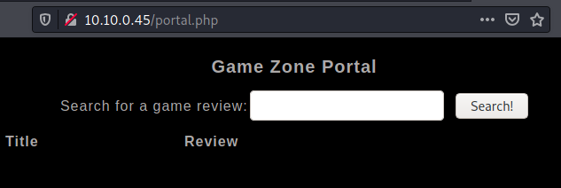

We now have to use SQLMap to dump the contents of the database.  But first, we have to know what happens when a search is made.  I used BurpSuite for this:

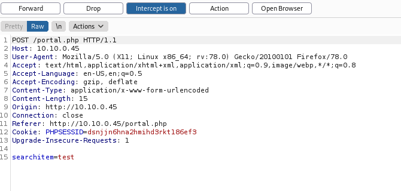

Now, save this into a `.txt` file and pass it into SQLMap using the following command:

```
$ sqlmap -r request.txt --dbms=mysql --dump
```

- `-r` is the file which contains the request from BurpSuite
- `--dbms` is the type of database management system being used on the system (in this case it is mysql)
- `--dump` tells SQLMap to output the entire database

Once SQLMap is finished, it will output the contents of the database:


#### Cracking Hashes with JohnTheRipper

We can now crack the hash with JohnTheRipper:

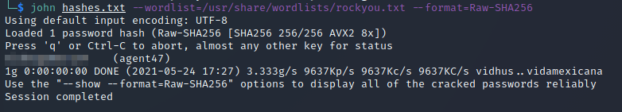

- `hash.txt` contains the hash(es) we are trying to crack
- `--wordlist` specifies the path to the wordlist (using `rockyou.txt`)
- `--format` is the hashing algorithm used (using SHA256)

Now you can use this password to login via SSH and get the `user.txt` flag:

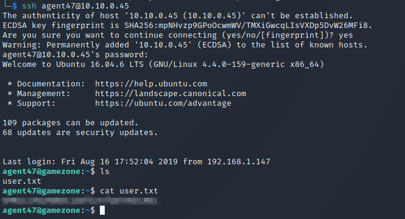

#### Privilege Escalation

Now it's time to escalate our privileges by port forwarding through SSH.  First run `ss` to get a list of listening ports on the machine.  

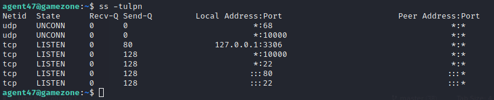

- `t` display TCP sockets
- `u` display UDP sockets
- `l` displays only listening sockets
- `p` shows the process using the socket
- `n` doesn't resolve service names

The result of this shows **5** TCP ports running.  Let's use port 10000 sticks out as it didn't show up on our initial nmap scan.  Run the following command to unblock port 10000:

```
$ ssh -L 10000:localhost:10000 agent47@<ip>
```

This lets us access port 10000 through our localhost via a web browser (navigate to `localhost:10000`).

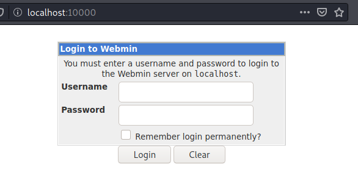

Logging in as `agent47` shows **Webmin v1.580** is being used as the site's Content Management System (CMS).

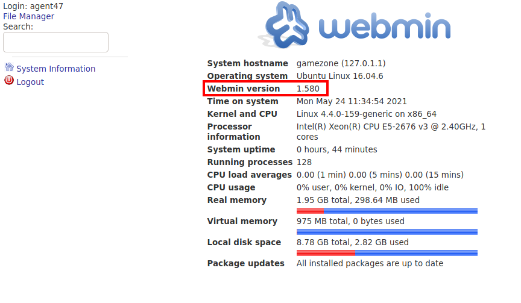

Let's use this information to search for any exploits:

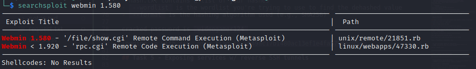

Searchsploit tells us that this specific version of Webmin is vulnerable to remote code injection (RCE).  Let's load up metasploit and escalate our privileges:

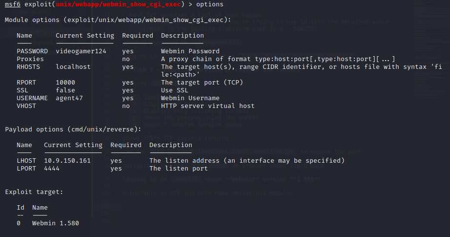

Running this exploit gives us access to the machine as the `root` user:

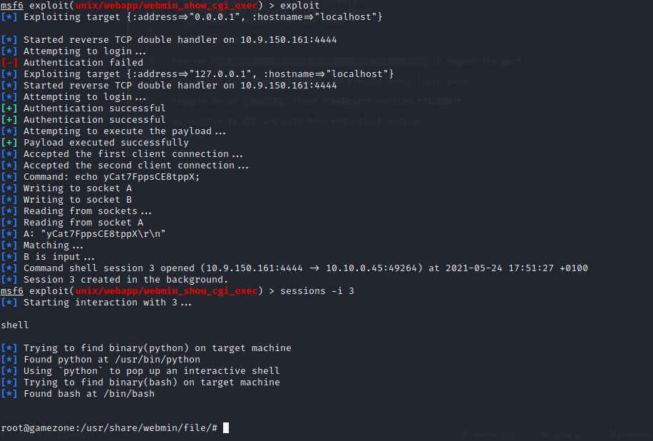

We can now retrieve the `root.txt` flag:

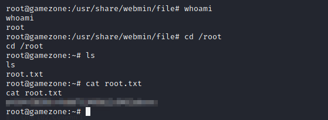

And that's it!  All done!

## Summary and Feedback

In this room we:
- Scanned ports using `nmap`
- Used SQL injection to compromise a login form
- Used `sqlmap` to dump the contents of the database
- Cracked the hashes using `JohnTheRipper`
- Used SSH port forwarding to unblock a hidden port
- Escalated our privileges by exploiting Webmin via remote code injection

This room was fairly straightforward and didn't take me too long to complete.  This was the first time I had used SQLMap extensively so it was good to learn a bit more about it. 

I hope you enjoyed this writeup.
