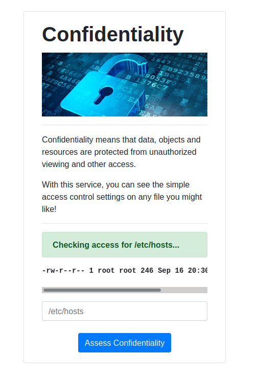
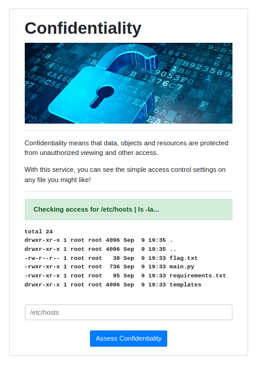
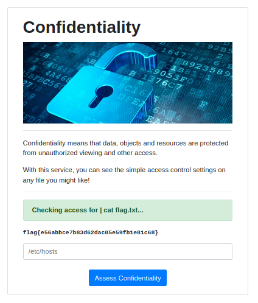

# Confidentiality | Web (container)

*My school was trying to teach people about the CIA triad so they made all these dumb example applications... as if they know anything about information security. Can you prove these aren't so secure?*

Launching the container and going to the web page.  I submitted the `/etc/hosts` through the form:



Then, I piped to a `ls -la` command to see if I could list the files in the directory:



Finally, I piped to a `cat flag.txt` to read the flag file:



```
flag{e56abbce7b83d62dac05e59fb1e81c68}
```