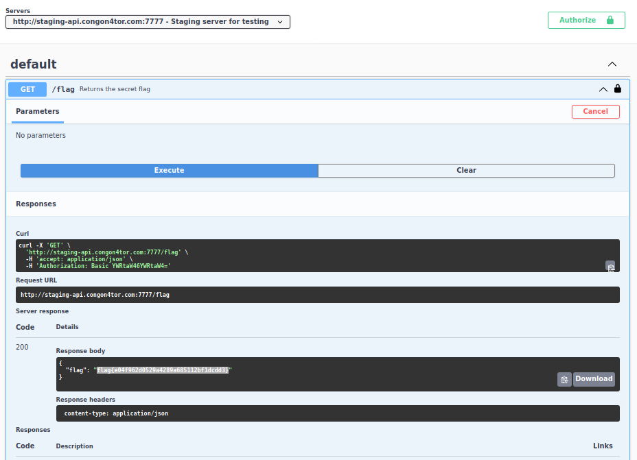

# Swaggy | Web (container)

*This API documentation has all the swag*

Launching the container and going to the web page, it appears to be the UI of the Swagger API.  It contains one entry `/flag` with two servers, one of which is unavailable.  Selecting the one which is available and authorizing myself as `admin:admin`, I ran the GET request to get the flag:



```
flag{e04f962d0529a4289a685112bf1dcdd3}
```