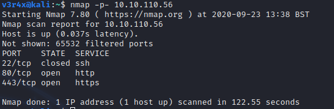

# Mr Robot CTF Writeup

## CTF Overview

Hello there!  This is my writeup for the Mr.Robot CTF virtual machine.  This challenge was a lot of fun, especially if you enjoy the TV show.  I would only recommend using this guide if you are stuck or if you wish to learn other ways of solving the box.

Also, if you are new to CTFs then don't worry if you have used a different tool than I have.

## How to Download

I completed this on TryHackMe, but you can find this VM on Vulnhub and other similar ethical hacking websites.  Additionally, if you notice various IP addresses changing throughout this writeup, know that this is due to the unique IP that TryHackMe assigns to the box for you to connect to.  This CTF was not done in one sitting, so I had to deploy the box multiple times, hence the difference IP addresses.

Links to the room:
- TryHackMe: https://tryhackme.com/room/mrrobot
- VulnHub: https://download.vulnhub.com/mrrobot/mrRobot.ova

I will not include a tutorial for the VulnHub setup, or how to install VirtualBox software, as there are thousands you can find on YouTube.

## Steps

### 1. Information Gathering and Enumeration

The first thing you should do is scan the remote host.  First, I ran a brief scan of all ports and then, second, a detailed scan using the results from the first.

Note that if you are using a VirtualBox to run the CTF machine then you will have to find the machine's IP before you run any targeted scans.

It looks like the target is running an Apache-based web server.  The best thing to do here is browse to the site and check it yourself.  When doing this, the goal is to do a basic technical analysis by exploring the site.  This can be done by visiting pages, clicking on any buttons, menus, and anything else we can find to have a better understanding of how the site functions.

I also like to run a directory bruteforce while I do this to see what I miss.  There are a few tools to do this like dirbuster and dirb, but I prefer gobuster.

These directory busting tools work similar to password bruteforcing: we are taking a list of words contained in a file and using them as search queries against the web server.  If it returns a 20X or 30X status code then we know something exists within that directory.  Here is the screengrab of the scan I ran:

While this scan was running I visited the site to see what I could find.  The homepage is a simple menu system to show content from the TV show:

A summary of what each command does is listed below:

- "prepare" and "fsociety" will bring up a video
- "inform" and "question" will bring up some pictures
- "wakeup" shows another video
- "join" connects you to a chat with Mr.Robot

As you dig a little deeper, using the results from gobuster as they come in, you will mostly hit dead ends.  Keep in mind that as you browse you should be checking the source code of each page to look for additional clues, intentionally placed or not, that could help you.

If you are patient, you will come across the robots page.  This file has two leads, one of which is the first flag, and the other is a dictionary file which we will use later.

Let's go ahead and download the dictionary file:

<pre><code>~$ wget [machine_ip]/fsocity.dic</code></pre>

### 2. Exploitation

From the gobuster results, we know that this site has a WordPress element to it.  Let's browse to /wp-admin and see what we can find:

One of the first things I try is "admin/admin" but it doesn't work.  However, the error message says "ERROR: invalid username...".  A more secure application would obfuscate which part of the login didn't work by saying something like "username or password was incorrect".  By telling us that the username is invalid, the application is inadvertently disclosing information to us.

So now we have to find a valid username.  I use Hydra to find this:

Okay, so the username is elliot.  Now let's find the password.  We will use the dictionary file from earlier along with Hydra to do this:

Now we also have the password: ER28-0652.  If you are fans of the show you will know this to be Elliot's employee number for AllSafe.  Now that we have the username/password combination, we can login to /wp-admin:

Now that we have logged in, our goal is to leverage our access to the application and gain access to the underlying server.  You can do this by modifying the application in such a way that, when you navigate to a particular page, the application sends a webshell back.  I used the default 404 Not Found response page for this step.  What you need next is webshell code that can be served up from a specific page.  This is where Google comes in handy.

I found this article [INSERT link to custom 404] on how to create your own 404 page using WordPress.  Kali Linux also includes code for several different webshells for different platforms:

The php-reverse-shell is perfect for this purpose.First, you need to make a copy of the shell.  To do this run the following command from the /usr/share/webshells directory:

<pre><code>/usr/share/webshells$ cp php-reverse-shell.php ~/Desktop/</code></pre>

All you need to do now is modify the file by including the IP of your machine and the port you will be listening for the connection on:

We can now overwrite the code on the WordPress site with this new page:

Now you need to set up your local listener to catch the webshell.  I used netcat for this:

Now browse to a non-existent page on the website:

And now if you check netcat you will have your shell:

I for one hate raw shells, so if you wnat to get out of them, you can use python to switch to a proper terminal:

It seems we are in the '/' root directory (don't get confused with /root which is the home directory for the root user).  I recommend you have a look around and see what you can find.  If you look into the /home directory, you can see that there is a local user called 'robot'.  Looking into this further reveals the next flag along with a md5 hash file:

Since we can't access the second flag we need to crack this hash.  MD5 hashes are trivial to crack.  I used Hashcat in the example below:

Now that we have the password we can use the su command on the robot user to grab the next flag:

### 3. Privilege Escalation

The last flag for most CTFs is almost always in the /root directory but only the root user has access to it.  A very common way of escalating privileges on a Linux system is to look for binaries that have the SUID bit set and abuse them.  For me, this took me quite a long time to figure out and resulted in me looking at the hint on the TryHackMe website, which simply is 'nmap'.  

A simple google search of 'nmap suid' gave me this article: [insert link] which discusses how to abuse a vulnerable version of nmap to gain root access.  From there we are able to get the final flag:

## Summary and My Feeback

Now that you have completed this machine and gained full root access, let's look at what we did to get there:

1. Scanned for open ports on the target machine:
    - Found ports 80 and 443 were open with port 22 closed.
    - Port 80/443 had Apache running on it indicating a web server.
2. Used GoBuster to bruteforce directories while we browsed the site ourselves:
    - Found the site had a WordPress blog running on it.
    - Found the first flag from robots.txt as well as a dictionary file.
3. Used Hydra to bruteforce the username and password of the WordPress blog:
    - Username: elliot; Password: ER28-0652.
4. Updated the default 404 page to include shellcode:
    - Used netcat to listen for the connection.
5. Found the second flag in the robot user's home directory:
    - Had to bruteforce an MD5 hash using HashCat to access it.
6. Escalated privileges to root to obtain the final flag:
    - Used a vulnerable version of nmap to do this.

And that's it!  I hope you found this guide useful and any feedback you have is appreciated.
