# Overpass 2 - Hacked Writeup

## Overview

This is my writeup for the Overpass 2 room on TryHackMe.  This is quite a varied room which involves using Wireshark to analyse a `.pcap` capture file.  You must then use the information you find to access the system and escalate your priveleges.

## How to Access

I completed this room on TryHackMe.  You can access it [here](https://tryhackme.com/room/overpass2hacked).

## Steps

#### Task 1 - Forensics - Analyse the PCAP

This part contains a downlaodable `.pcap` file.  Let's open Wireshark and see what's going on.  Firstly, a HTTP GET request is being made to the **`/development`** directory:

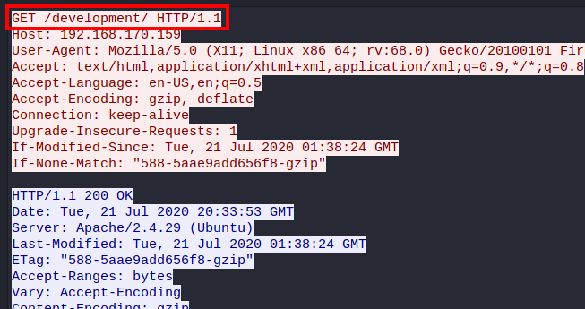

This is where the following payload is being uploaded:

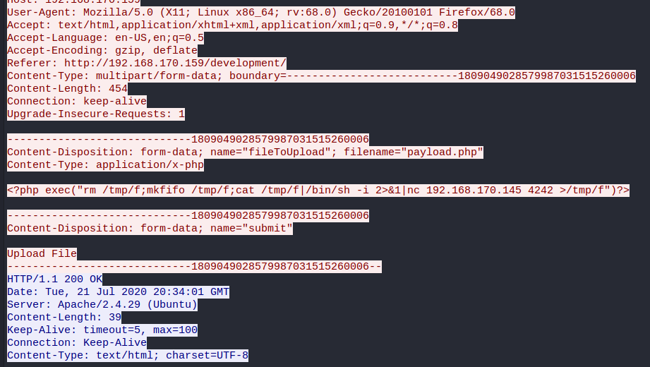

The attacker then runs `sudo -l` as the `james` user using the given password:

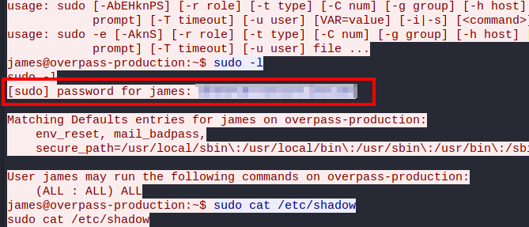

After they dump the `/etc/shadow` file, they establish persistence using the **`https://github.com/NinjaJc01/ssh-backdoor`**:

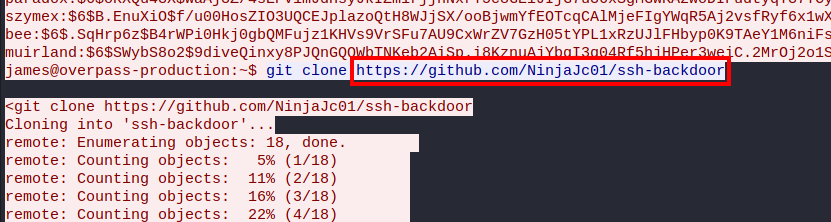

Using `JohnTheRipper` and the `fasttrack` wordlist (found [here](https://gitlab.com/kalilinux/packages/set/-/blob/d9fd94cbe53940381de66e506a233c33cfb38c8a/src/fasttrack/wordlist.txt)), you can crack the hashes in the dumped `/etc/shadow` file:

```
$ john shadow --wordlist fasttrack.txt
Using defualt input encoding: UTF-8
Loaded 5 password hashes with 5 different salts (sha512crypt, crypt(3) $6$ [SHA512 256/256 AVX2 4x])
Remaining 1 password hash
Cost 1 (iteration count) is 5000 for all loaded hashes
Will run 12 OpenMP threads
Press 'q' or Ctrl-C to abord, almost any other key for status
0g 00:00:00:00 DONE (2021-05-26 20:21) 0g/s 3000p/s 3000c/s 3000C/s P@55w0rd..starwars
Session compelted.
$ john shadow --show
paradox:*********:18646:0:99999:7:::
szymex:*******:18464:0:99999:7:::
bee:********:18464:0:99999:7:::
muirland:********:18464:0:99999:7:::

4 password hashes cracked, 1 left
```

As you can see, it was able to crack **4** out of the 5 passwords.

#### Task 2 - Research - Analyse the Code

Analysing the backdoor code (found [here](https://github.com/NinjaJc01/ssh-backdoor)), the **default hash** for the backdoor is:

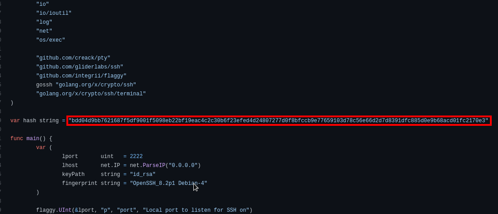

And the **hardcorded salt** for the backdoor is:

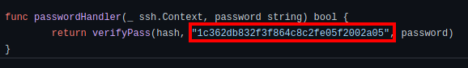

Now, back to the `.pcap` file, the **hash** which the attacker used is as follows:

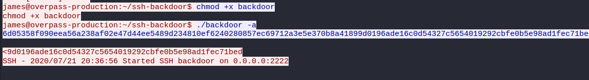

In order to crack this hash with `hashcat`, you first have to find the type of the hash.  As we know, the hash is SHA512 and contains a hashed password followed by a salt.  Using that information, we are able to determine the type:

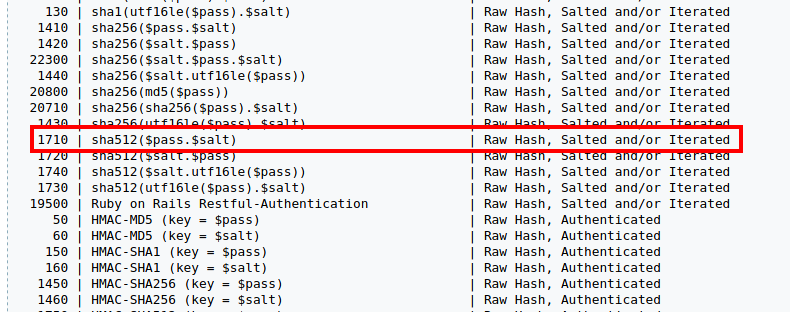

Now, we're able to crack the hash:

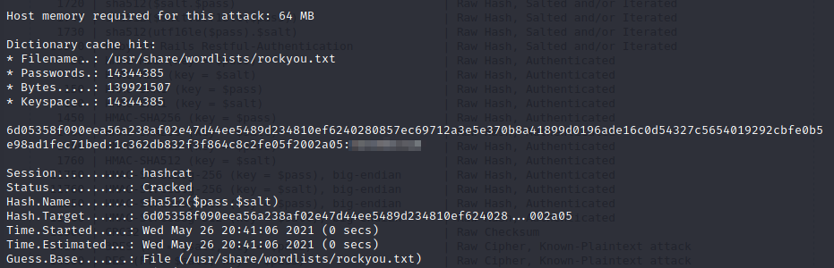

#### Task 3 - Attack - Get Back In!

Now we can use this information to get back into the site.  Running an `nmap` scan, we can see that there is another SSH service running on port 2222:

```
$ nmap -sC -sV -oN scans/initial 10.10.247.107
Starting Nmap 7.91 ( https://nmap.org ) at 2021-05-26 20:44 BST
Nmap scan report for 10.10.247.107
Host is up (0.065s latency).
Not shown: 997 closed ports
PORT     STATE SERVICE VERSION
22/tcp   open  ssh     OpenSSH 7.6p1 Ubuntu 4ubuntu0.3 (Ubuntu Linux; protocol 2.0)
| ssh-hostkey: 
|   2048 e4:3a:be:ed:ff:a7:02:d2:6a:d6:d0:bb:7f:38:5e:cb (RSA)
|   256 fc:6f:22:c2:13:4f:9c:62:4f:90:c9:3a:7e:77:d6:d4 (ECDSA)
|_  256 15:fd:40:0a:65:59:a9:b5:0e:57:1b:23:0a:96:63:05 (ED25519)
80/tcp   open  http    Apache httpd 2.4.29 ((Ubuntu))
|_http-server-header: Apache/2.4.29 (Ubuntu)
|_http-title: LOL Hacked
2222/tcp open  ssh     OpenSSH 8.2p1 Debian 4 (protocol 2.0)
| ssh-hostkey: 
|_  2048 a2:a6:d2:18:79:e3:b0:20:a2:4f:aa:b6:ac:2e:6b:f2 (RSA)
Service Info: OS: Linux; CPE: cpe:/o:linux:linux_kernel

Service detection performed. Please report any incorrect results at https://nmap.org/submit/ .
Nmap done: 1 IP address (1 host up) scanned in 38.57 seconds
```

There is also a defaced website running on port 80, showing the text **H4ck3d by CooctusClan**:

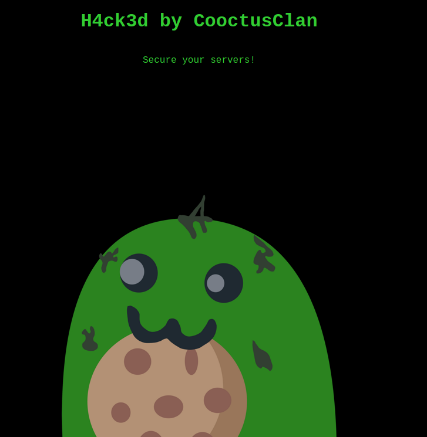

As we know from the `.pcap` analysis, the attackers were logged in as the `james` user with the password which we cracked earlier.  We can use these credentials to log in through this SSH port:


From here, we're able to grab the `user.txt` flag:


There is also a `.suid_bash` file in the `/home/james` directory:


Running this using `-p` meaning that we maintain permissions, allows us to escalate our privileges to the `root` user and subsequently grab the `root.txt` flag:

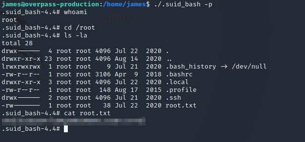

## Summary and Feedback

In this room we:
- Used `Wireshark` to analyse a `.pcap` file
- Used `JohnTheRipper` to crack hashes from a dumped `/etc/shadow` file
- Used `hashcat` to crack a hash with a known salt
- Replicated the attacker's actions to break into the system
- Escalated our privileges using a file which the hackers behind

This was a very quick and easy room to compelte and effectively combines key aspects of both forensics and penetration testing.

I hope you enjoyed this writeup.