# Pickle Rick - Writeup

## Overview

This is my writeup for the Pickle Rick CTF.  This is a free room of easy difficulty which tests your knowledge of enumeration and linux commands.

## How to Access

I completed this room on TryHackMe.  The link to the room is shown below:

- https://tryhackme.com/room/picklerick

## Steps

#### Reconnaissance

As usual, the first thing you should do is enumerate.  I began with a simple `nmap` scan:

```
$ nmap -sC -sV -oN nmap/initial 10.10.6.223                        
Starting Nmap 7.91 ( https://nmap.org ) at 2021-04-12 18:37 BST Nmap scan report for 10.10.6.223
Host is up (0.17s latency).
Not shown: 998 closed ports
PORT   STATE SERVICE VERSION
22/tcp open  ssh     OpenSSH 7.2p2 Ubuntu 4ubuntu2.6 (Ubuntu Linux; protocol 2.0)
| ssh-hostkey: 
|   2048 80:db:87:31:0d:17:d5:01:0f:03:d1:ab:45:10:5d:c3 (RSA)
|   256 e0:65:b7:a4:60:68:f5:fe:c3:6a:47:52:52:7b:e3:f1 (ECDSA)
|_  256 f1:e7:08:30:5f:ff:e7:9c:da:73:f4:a7:b3:c9:65:6b (ED25519)
80/tcp open  http    Apache httpd 2.4.18 ((Ubuntu))
|_http-server-header: Apache/2.4.18 (Ubuntu)
|_http-title: Rick is sup4r cool
Service Info: OS: Linux; CPE: cpe:/o:linux:linux_kernel

Service detection performed. Please report any incorrect results at https://nmap.org/submit/ .
Nmap done: 1 IP address (1 host up) scanned in 9.10 seconds
```
It shows an open SSH port (22) and Apache web server (port 80).  I navigated to the website while running `gobuster` and `nikto` in the background to further enumerate the machine.

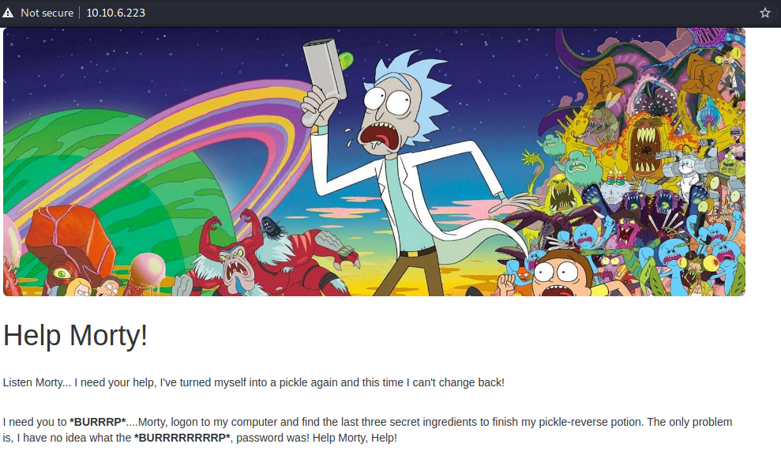

The source code of the website also reveals in interesting comment:

```
<!--

Note to self, remember username!

Username: R1ckRul3s

-->
```

I also looked at `robots.txt` which simply contained: `Wubbalubbadubdub`.

The output of `gobuster` shows an `/assets` folder containing various media files.

```
===============================================================
Gobuster v3.1.0
by OJ Reeves (@TheColonial) & Christian Mehlmauer (@firefart)
===============================================================
[+] Url:                     http://10.10.6.223/
[+] Method:                  GET
[+] Threads:                 10
[+] Wordlist:                /usr/share/wordlists/dirbuster/directory-list-2.3-small.txt
[+] Negative Status codes:   404
[+] User Agent:              gobuster/3.1.0
[+] Timeout:                 10s
===============================================================
2021/04/12 18:43:58 Starting gobuster in directory enumeration mode
===============================================================
/assets               (Status: 301) [Size: 311] [--> http://10.10.6.223/assets/]
===============================================================
2021/04/12 18:51:45 Finished
===============================================================
```

The `nikto` scan revealed a `login.php` page. 

```
- Nikto v2.1.6
---------------------------------------------------------------------------
+ Target IP:          10.10.6.223
+ Target Hostname:    10.10.6.223
+ Target Port:        80
+ Start Time:         2021-04-12 18:47:26 (GMT1)
---------------------------------------------------------------------------
+ Server: Apache/2.4.18 (Ubuntu)
+ The anti-clickjacking X-Frame-Options header is not present.
+ The X-XSS-Protection header is not defined. This header can hint to the user agent to protect against some forms of XSS
+ The X-Content-Type-Options header is not set. This could allow the user agent to render the content of the site in a different fashion to the MIME type
+ No CGI Directories found (use '-C all' to force check all possible dirs)
+ Apache/2.4.18 appears to be outdated (current is at least Apache/2.4.37). Apache 2.2.34 is the EOL for the 2.x branch.
+ Server may leak inodes via ETags, header found with file /, inode: 426, size: 5818ccf125686, mtime: gzip
+ Cookie PHPSESSID created without the httponly flag
+ Allowed HTTP Methods: OPTIONS, GET, HEAD, POST 
+ OSVDB-3233: /icons/README: Apache default file found.
+ /login.php: Admin login page/section found.
+ 7889 requests: 0 error(s) and 9 item(s) reported on remote host
+ End Time:           2021-04-12 18:54:09 (GMT1) (403 seconds)
---------------------------------------------------------------------------
+ 1 host(s) tested
```

Now that I have completed enumeration, I attempted to login via the `login.php` page using the username I found earlier.  The login panel is shown below:

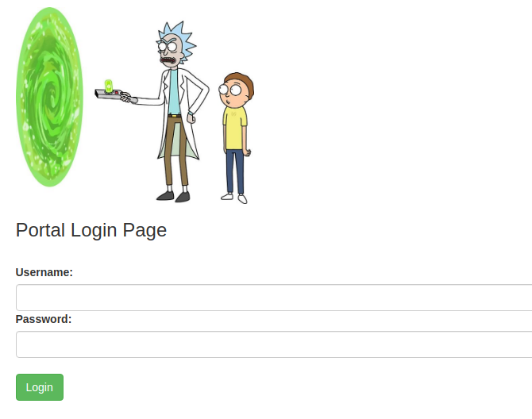

#### Gaining Access

I realised that the jibberish from the `robots.txt` file may be the password for the `R1ckRul3s` user.  Using this username/password combination, I was able to login:

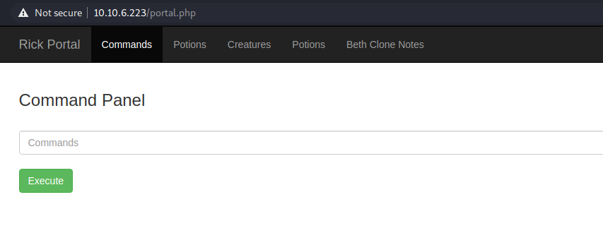

All other pages except "Commands" are restricted to the `R1ckRul3s` user.

#### Finding the First Flag

I tried a few basic Linux commands to verify that the commands were working:

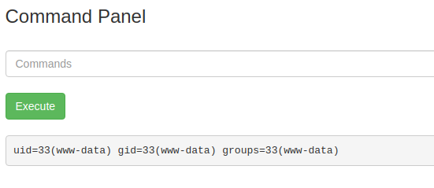

This command panel appears to connect me as the `www-data` user.  I then proceeded to list the contents of the current directory (using `ls -la`):

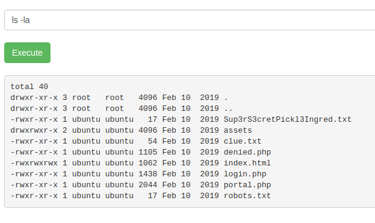

Unfortunately, the `cat` command is filtered out along with `head` and `tail`.  So, navigating to the `Sup3rS3cretPick13Ingred.txt` file it gives us the first ingredient (flag 1):

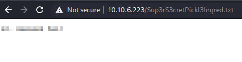

Also, inspecting the contents of `clue.txt` reveals the following:

```
Look around the file system for the other ingredient.
```

#### Finding the Second Flag

As this is a UNIX file system, it will contain the following common directories:

- `/root`: the home directory of the root user.
- `/etc`: configuration files.
- `/home`: home folders for each user.
- `/lib`: essential shared libraries.
- `/lost+found`: recovered files.
- `/media`: removable media.
- `/mnt`: temporary mount points.
- `/opt`: optional packages install directory.
- `/run`: application state files.
- `/sbin`: system administrator binaries.
- ...

Viewing the contents of the `/home` directory reveals a `rick` directory.  Within this directory, there is a `second ingredients` file.

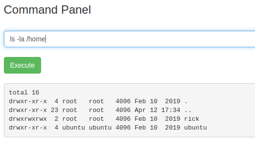

Fortunately, you can use the `less` command to view its contents:

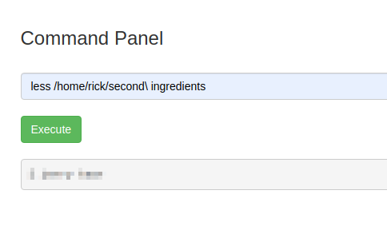

This gives us the second ingredient (flag 2).

#### Finding the Third and Final Flag

I suspected that the final flag would be in the `/root` directory.  Currently, I am unable to access it as the `www-data` user so we must find a way around this.  Using `sudo -l` I was able to view what I can run as the `www-data` user:

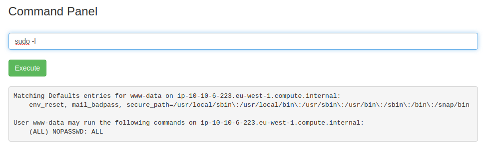

As shown, you can execute *any* command on this box *without* a password: `(ALL NOPASSWD:ALL)`.  All I need to do is prepend `sudo` to the start of the command and I can execute it.

Viewing the contents of the `/root` directory:

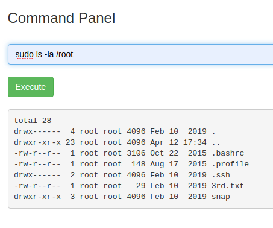

It shows a `3rd.txt` which contains the final ingredient (final flag):

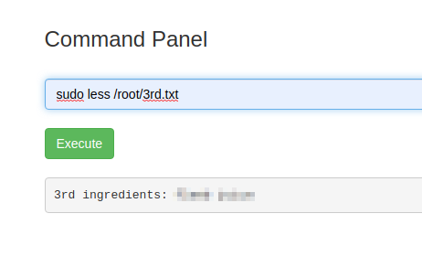

And that's it!

## Summary and Feedback

As mentioned, this room is designed for beginners.  It is a very enjoyable challenge and it really tests your ability to navigate through a UNIX/Linux system as well as your information gathering techniques - two fundamental skills for penetration testing.
